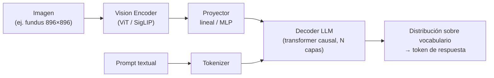
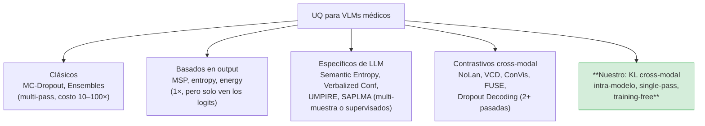

# 02 — Marco Teórico

> **Propósito de este documento:** establecer el andamiaje conceptual sobre el que se sostiene el experimento: qué son los Vision-Language Models y cómo están construidos, qué es la cuantificación de incertidumbre (UQ) y qué métodos existen, por qué los métodos existentes no resuelven el problema que atacamos, y qué es el glaucoma como tarea clínica de screening. El lector debería terminar esta sección entendiendo *por qué* la divergencia KL cross-modal en un solo forward pass es una propuesta nueva y dónde se ubica en el mapa de la literatura.

[⬅️ 01 — Índice General](01_Indice_General.md) | [➡️ 03 — Hipótesis y Diseño Experimental](03_Hipotesis_y_Diseno_Experimental.md)

---

## 2.1 Vision-Language Models (VLMs)

### 2.1.1 Arquitectura general

Un Vision-Language Model moderno combina tres piezas: un **vision encoder** (típicamente un Vision Transformer entrenado con contraste imagen-texto, al estilo CLIP/SigLIP), un **proyector** que mapea las representaciones visuales al espacio de embeddings del modelo de lenguaje, y un **decoder de lenguaje** autorregresivo que trata los "tokens de imagen" proyectados como parte de su secuencia de entrada. El decoder es el mismo tipo de transformer causal que un LLM; la única diferencia es que una porción de sus posiciones de entrada proviene de la imagen.

Familias representativas: **LLaVA** (CLIP + Vicuna), **CogVLM** (con expertos visuales profundos en cada capa), la familia **Qwen-VL**, y los modelos **Gemma 3 multimodales**. En el dominio médico destacan **LLaVA-Med** (Li et al., 2023 — fine-tuning de LLaVA con instrucciones biomédicas), **RadFM**, **Med-Flamingo**, y la línea que nos ocupa: **MedGemma** (Google Research, 2025).

### 2.1.2 MedGemma y MedSigLIP

MedGemma es la familia médica de Gemma 3. La variante de 4B parámetros (`google/medgemma-4b-it`) combina:

- **MedSigLIP**: un vision encoder SigLIP (~400M parámetros) adaptado a imágenes médicas (retinografía, dermatología, radiografía, histopatología). Produce 256 tokens de imagen a partir de entradas de 896×896 px (patches de 14×14, con reducción posterior).
- **Un proyector** que lleva cada token visual de 1152 dimensiones a las 2560 dimensiones del espacio del decoder.
- **El decoder Gemma 3 (4B)**: 34 capas de transformer decoder-only, dimensión oculta 2560, atención causal. El vocabulario tiene 262.144 entradas de tokenizer (262.208 filas en la matriz de embeddings, incluyendo tokens especiales reservados como el `<image_soft_token>` = 262.144).

Los reportes técnicos de MedGemma documentan mejoras sustanciales sobre modelos base en benchmarks médicos de imagen (Sellergren et al., 2025), pero **no incorporan ningún mecanismo nativo de cuantificación de incertidumbre** — y mucho menos uno basado en comparar representaciones internas entre modalidades. Ese hueco es el que ocupa este proyecto.

### 2.1.3 El punto clave para nosotros: dos modalidades conviven en el mismo decoder

Durante el forward pass de un VLM, los hidden states de las posiciones de imagen y los de las posiciones de texto **evolucionan dentro del mismo espacio de 2560 dimensiones**, capa a capa, influenciándose mutuamente por la atención. En la última capa, el estado del token que está a punto de generar la respuesta ("yes"/"no") y los estados de los 256 tokens de imagen son, formalmente, **dos vistas del mismo caso clínico escritas en el mismo idioma vectorial**. Que se puedan comparar directamente — con una divergencia entre distribuciones — es la premisa técnica de toda esta tesis (ver [§2.6](#26-cross-modal-disagreement-como-señal-de-incertidumbre)).

---

## 2.2 Uncertainty Quantification en Deep Learning

### 2.2.1 Taxonomía: incertidumbre aleática vs. epistémica

La literatura distingue dos fuentes de incertidumbre (Hüllermeier & Waegeman, 2021):

- **Aleática (de los datos):** la irreducible. En oftalmología: una imagen borrosa, un caso genuinamente frontera entre copete fisiológico y glaucoma incipiente. Ningún modelo la elimina.
- **Epistémica (del modelo):** la que proviene de no saber lo suficiente. Se reduce con más datos o mejor modelo; es la que debería disparar la derivación al especialista.

Nuestra señal no pretende descomponer la incertidumbre en estas dos familias (una ambición mayor); pretende algo más pragmático y clínicamente accionable: **detectar cuándo la respuesta del modelo es probablemente errónea**, cualquiera que sea la causa.

### 2.2.2 Métodos clásicos

| Método | Idea | Costo | Limitación central |
|---|---|---|---|
| **MC-Dropout** (Gal & Ghahramani, 2016) | Dropout activo en inferencia; dispersión entre T pasadas | 10–100× | Multi-pass; calibración discutible |
| **Deep Ensembles** (Lakshminarayanan et al., 2017) | Entrenar M modelos; dispersión entre ellos | M× en entrenamiento e inferencia | Costoso; requiere entrenamiento |
| **Temperature Scaling** (Guo et al., 2017) | Reescalar logits para calibrar probabilidades | 1× post-hoc | Calibra pero no detecta errores bien; requiere set de calibración |
| **Conformal Prediction** (Vovk et al., 2005) | Cobertura garantizada por construcción de conjuntos | 1× + calibración | Produce conjuntos, no ranking de triage; necesita exchangeability |
| **Selective prediction / AURC** (Geifman & El-Yaniv, 2017) | Abstenerse en los casos de mayor riesgo estimado | Depende de la señal de riesgo | Necesita una buena señal — que es lo que aportamos |

La familia de **selective prediction** (clasificar con opción a abstención) es el marco evaluativo de este proyecto: la curva riesgo-cobertura y su área (AURC) miden exactamente la utilidad clínica de una señal de triage (ver [§3.5](03_Hipotesis_y_Diseno_Experimental.md) y [§6.6b](06_Resultados_Experimentales.md)).

### 2.2.3 Taxonomía de métodos UQ aplicable a VLMs

---

## 2.3 UQ para LLMs y VLMs

Los métodos diseñados para modelos de lenguaje generativos se agrupan en cuatro líneas:

1. **Consistencia semántica entre muestreos.** *Semantic Entropy* (Kuhn et al., 2023; Farquhar et al., 2024) muestrea N respuestas, las agrupa por significado y mide la entropía de los significados. Es el estado del arte para preguntas abiertas, pero requiere ~10 generaciones por entrada (costo 10×). Nuestro baseline **Self-Consistency** (Wang et al., 2022) pertenece a esta familia; en [§6.10.2](06_Resultados_Experimentales.md) mostramos que a temperatura 1.5 MedGemma deriva fuera del formato de respuesta y que su mejor señal (AUROC 0.655) queda por debajo de la nuestra a 1/10 del costo.
2. **Confianza verbalizada.** Pedirle al modelo que declare su confianza ("how confident are you, 0–100?"). Barato (2×) pero, como verificamos empíricamente, **degenerado en VLMs instruction-tuned**: MedGemma solo usa los valores 90 y 95 (ver [§6.10.1](06_Resultados_Experimentales.md)).
3. **Sondas supervisadas sobre estados internos.** *SAPLMA* (Azaria & Mitchell, 2023) entrena clasificadores sobre hidden states para predecir veracidad. Potente, pero requiere datos etiquetados y entrenamiento — no es training-free.
4. **Métodos híbridos.** *UMPIRE* (Beck et al., 2024) y *VIG-TUQ* combinan señales internas y de salida; en general multi-muestra. VIG-TUQ es el más cercano en espíritu por usar señales internas de atención en VLMs (costo 1×–2×), pero no extrae divergencias entre representaciones de modalidades (ver tabla comparativa en [§6.12](06_Resultados_Experimentales.md)).

---

## 2.4 Estado del arte en métodos cross-modales y contrastivos (los más cercanos)

Esta es la familia más cercana a nuestra propuesta y la que define su novedad. Un especialista externo verificó que **la combinación MedGemma 4B + divergencia KL cross-modal en un solo forward pass + UQ para glaucoma no existe previamente en la literatura**:

| Trabajo | Modelo | Mecanismo de divergencia/distancia | Modalidad de inferencia | Aplicación |
|---|---|---|---|---|
| **Nuestro** | **MedGemma 4B** | **KL cross-modal (hidden states visuales vs. textual del decoder)** | **Single forward pass O(1)** | **UQ en glaucoma (retinografía)** |
| NoLan (2024) | LLaVA / Vicuna | KL entre P(multimodal) y P(solo texto) | Múltiples pasadas (contraste) | Mitigación de alucinaciones |
| VCD (Leng et al., 2024) | MLLMs genéricos | KL entre imagen original vs. distorsionada | Múltiples pasadas (contraste) | Reducción de alucinaciones de objetos |
| ConVis (2024) | MLLMs | KL con imagen reconstruida | Múltiples pasadas (contraste) | Alucinaciones |
| FUSE (2024) | CLIP + LLM | Procesos gaussianos + diversidad semántica | Muestreo multi-respuesta | Incertidumbre epistémica |
| Dropout Decoding | LVLMs | Ensamble por máscara de tokens visuales (majority voting) | Múltiples subconjuntos | Incertidumbre perceptual |
| FairCLIP (Luo et al., 2024) | CLIP / BLIP-2 | Distancia de Sinkhorn (transporte óptimo) | Alineación de embeddings | Equidad diagnóstica en glaucoma (Harvard-FairVLMed, 10.000 imgs) |

Puntos clave del análisis de novedad (que reaparecen en la discusión, [§8.1b](08_Discusion_y_Limitaciones.md)):

- **NoLan y VCD** son los más cercanos conceptualmente (usan KL cross-modal), pero contrastan la **distribución de salida** bajo dos **condiciones de entrada distintas** (multimodal vs. solo texto; original vs. distorsionada). Requieren 2+ pasadas y miden sesgo/alucinación, no incertidumbre intra-modelo en una pasada. Nuestro contraste es **intra-modelo**: compara dos representaciones internas del *mismo* forward, no dos forwards.
- **FUSE** estima incertidumbre epistémica proyectando tokens visuales al espacio textual, pero con procesos gaussianos sobre encoders congelados más muestreos semánticos múltiples: training-free pero multi-pass; no un cálculo cerrado en una inferencia.
- **FairCLIP** usa distancia de Sinkhorn en lugar de KL citando su asimetría y la violación de la desigualdad triangular. **Nuestra respuesta de diseño:** reportamos siempre **ambas direcciones** de KL (ver [§6.9b](06_Resultados_Experimentales.md)) y evaluamos **JSD** como variante simétrica (que resultó saturarse en $\ln 2$ por la brecha modal, ver [§7.1](07_Ablaciones_y_Analisis_Profundo.md)). Además, su objetivo (equidad) es ortogonal al nuestro (detección de errores) — y su dataset, **Harvard-FairVLMed** (10.000 imágenes SLO + notas clínicas), es el candidato natural para la Fase 2 de la tesis.
- **MedGemma** no incorpora mecanismos nativos de UQ basados en KL cross-modal durante la generación autorregresiva.

El análisis del especialista también identificó riesgos que el diseño incorporó de antemano: la **dilución espacial** del disco óptico (→ ablaciones de pooling: roi, attn, topk, normw, rollout, headspec), la **brecha modal** (→ temperaturas τ = 1/2/4, JSD), la **asimetría de KL** (→ ambas direcciones siempre reportadas) y la **accionabilidad clínica** (→ esquema de triage por percentiles + zona verde).

Finalmente, **Grad-CAM e Integrated Gradients** fueron considerados y descartados como señal UQ: requieren backward pass (rompen el framing single-pass 1×) y en bfloat16 los gradientes son inestables; pertenecen a la familia XAI (explicación), no UQ. Quedan como future work (ver [§8.5](08_Discusion_y_Limitaciones.md)).

---

## 2.5 El problema de la dilución espacial en imágenes médicas

En una fotografía de fondo de ojo completa, el **disco óptico** — la estructura donde se lee el glaucoma — ocupa apenas el **5–10% de los píxeles**. Si los 256 tokens de imagen se resumen con un promedio simple (`mean` pooling), la señal del disco queda diluida en el ruido del fondo (vasos, mácula, periferia, artefactos). Este es el riesgo metodológico número uno de cualquier pooling global sobre imágenes médicas, y fue señalado explícitamente por el especialista.

El diseño responde con una **ablación exhaustiva de 8 estrategias de pooling** (detalladas en [§4.5](04_Arquitectura_Tecnica.md)): desde `mean` y `max` hasta poolings ponderados por atención (`attn`, `rollout`, `headspec`), por norma (`topk`, `normw`) y un *oracle* con máscaras del disco (`roi`). El resultado empírico ([§7.2](07_Ablaciones_y_Analisis_Profundo.md)) fue contraintuitivo e importante: **`max` pooling gana**, y la atención del modelo frozen no está alineada con la tarea — los poolings guiados por atención rinden *peor* que el máximo elemento a elemento.

---

## 2.6 Cross-Modal Disagreement como señal de incertidumbre

### 2.6.1 Intuición

Cuando un VLM procesa un caso que domina, sus dos "voces internas" — la visual y la textual — convergen: la representación de la respuesta que está a punto de emitir está anclada en lo que la representación visual soporta. Cuando el caso es ambiguo o el modelo se equivoca, esa convergencia se rompe: el texto afirma con seguridad algo que la imagen no respalda. Si esa ruptura se puede medir, tenemos una alarma.

Formalmente, en la última capa del decoder (capa 34) extraemos:

- $h^{(vis)}_1, \dots, h^{(vis)}_{256} \in \mathbb{R}^{2560}$: hidden states de los tokens de imagen;
- $h^{(text)} \in \mathbb{R}^{2560}$: hidden state de la última posición del prefill — el estado desde el que el modelo genera su primer token de respuesta.

Un pooling $\pi$ resume los 256 vectores visuales en $\bar{h}^{(vis)} = \pi(h^{(vis)}_1, \dots, h^{(vis)}_{256})$, y ambos vectores se convierten en distribuciones sobre su propio espacio de dimensiones con una softmax con temperatura $\tau$:

$$p_{vis} = \mathrm{softmax}(\bar{h}^{(vis)} / \tau), \qquad p_{text} = \mathrm{softmax}(h^{(text)} / \tau)$$

La señal de incertidumbre es la divergencia de Kullback-Leibler en la dirección texto→imagen:

$$u(x) = D_{KL}(p_{text} \,\Vert\, p_{vis}) = \sum_{i=1}^{2560} p_{text,i} \ln \frac{p_{text,i}}{p_{vis,i}}$$

La elección de dirección no es arbitraria: $D_{KL}(p_{text}\Vert p_{vis})$ pondera la divergencia por donde **el texto** pone su masa, y responde a la pregunta *"¿el texto afirma cosas que la imagen no respalda?"* — la dirección de la alucinación. La dirección espejo mide la riqueza trivial imagen>texto (una retinografía siempre contiene más que un sí/no), que es casi constante entre imágenes: ruido. Los datos lo confirman (AUROC 0.661 vs. 0.566, p = 0.006 vs. 0.149; ver [§6.9b](06_Resultados_Experimentales.md)).

### 2.6.2 Propiedades que la distinguen

La señal es simultáneamente:

1. **Training-free:** no se entrena ni calibra nada; el modelo queda frozen.
2. **Single-pass:** se extrae del mismo forward que produce la respuesta (costo 1×; los baselines SC y verbalized cuestan 10× y 2×).
3. **Cross-modal:** explota la naturaleza bimodal del VLM — información que los métodos basados solo en logits no pueden ver, porque el desacuerdo ocurre *antes* de la generación.

Ningún método publicado reúne las tres propiedades a la vez (ver tabla de [§2.4](#24-estado-del-arte-en-métodos-cross-modales-y-contrastivos-los-más-cercanos) y [§6.12](06_Resultados_Experimentales.md)).

---

## 2.7 Glaucoma y diagnóstico por imagen de fondo de ojo

El **glaucoma** es una neuropatía óptica progresiva y una de las principales causas de ceguera irreversible en el mundo. Es asintomático hasta etapas avanzadas, lo que convierte al **screening** en la intervención de mayor impacto: detectarlo temprano frena la pérdida visual.

El signo cardinal en retinografía es el **cup-to-disc ratio (CDR)**: la proporción entre la excavación (copa) y el disco óptico. Un CDR alto (típicamente ≥ 0.6–0.7) sugiere pérdida de rima neuroretinal, pero la frontera diagnóstica es clínicamente sutil: el **copete fisiológico** (CDR grande benigno) y la **miopía** (que deforma el disco) simulan glaucoma. Por eso los clínicos evalúan un conjunto de signos: rima neuroretinal (regla ISNT), hemorragias de Drance, atrofia peripapilar, defectos de la capa de fibras nerviosas (RNFL), palidez del disco y cambios vasculares — exactamente los **7 gradings ordinales** que el dataset MM-ODIR-129 anota por imagen (ver [09 — Dataset](09_Dataset_MM_ODIR_129.md)).

El escenario de despliegue que motiva la UQ es el **triage automatizado**: un VLM que pre-clasifica imágenes de screening debe *saber cuándo no sabe* y derivar esos casos al oftalmólogo, en lugar de responder sobreconfiado. Nuestros resultados sobre la confianza verbalizada de MedGemma (declara 95% de confianza en el 91.5% de las imágenes mientras acierta el 80.5%; ver [§6.10.1](06_Resultados_Experimentales.md)) muestran que, sin una señal como la nuestra, el modelo es un mal juez de sí mismo.

---

## Referencias citadas (inline)

Azaria & Mitchell (2023) · Beck et al. (2024) · Cormack et al. (2009) · Farquhar et al. (2024) · Gal & Ghahramani (2016) · Geifman & El-Yaniv (2017) · Guo et al. (2017) · Hüllermeier & Waegeman (2021) · Kuhn et al. (2023) · Lakshminarayanan et al. (2017) · Leng et al. (2024) · Li et al. (2023, LLaVA-Med) · Luo et al. (2024, FairCLIP) · Sellergren et al. (2025, MedGemma) · Vovk et al. (2005) · Wang et al. (2022, Self-Consistency) · Abnar & Zuidema (2020, Attention Rollout)

---

[⬅️ 01 — Índice General](01_Indice_General.md) | [➡️ 03 — Hipótesis y Diseño Experimental](03_Hipotesis_y_Diseno_Experimental.md)
