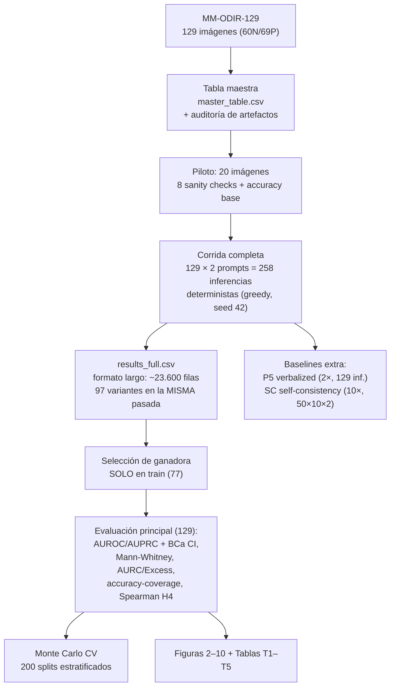

# 03 — Hipótesis y Diseño Experimental

> **Propósito:** fijar formalmente qué se puso a prueba, con qué variables, qué protocolo y qué métricas. Este documento es la versión ejecutada de la definición experimental congelada (`Definicion_Experimental_Minima_BIP2026.md`, v2); los resultados correspondientes están en [06 — Resultados](06_Resultados_Experimentales.md).

[⬅️ 02 — Marco Teórico](02_Marco_Teorico.md) | [➡️ 04 — Arquitectura Técnica](04_Arquitectura_Tecnica.md)

---

## 3.1 Hipótesis formales

**Pregunta de investigación:** cuando MedGemma-4B se equivoca al detectar glaucoma en una fotografía de fondo de ojo, ¿el desacuerdo entre su representación visual interna y su representación textual es mayor que cuando acierta?

De ella se derivan cuatro hipótesis operativas:

| Hipótesis | Enunciado | Criterio de verificación |
|---|---|---|
| **H1** | La señal KL cross-modal tiene **AUROC > 0.5** (mejor que azar) para detectar errores del modelo | AUROC con IC 95% BCa que excluya 0.5; Mann-Whitney U significativo (α = 0.05). Meta de diseño: AUROC ≥ 0.65 |
| **H2** | La señal KL **supera los baselines de igual costo** (entropy, 1−MSP, energy) | AUROC puntual mayor que los tres baselines 1× |
| **H3** | La señal KL es **complementaria** a los baselines: la combinación `rank(KL) + rank(1−MSP)` supera a ambas componentes | AUROC de la combinación > max(AUROC KL, AUROC 1−MSP), con Excess-AURC claramente menor (análisis exploratorio) |
| **H4** (exploratoria) | En imágenes patológicas, la incertidumbre se **correlaciona con la severidad** del glaucoma (CDR grade) | Correlación de Spearman con test de permutación, n = 69 |

**Veredictos (adelanto; desarrollo completo en [06](06_Resultados_Experimentales.md) y [11](11_Conclusiones_y_Proximos_Pasos.md)):** H1 **verificada** (0.661 [0.522, 0.772], p = 0.006); H2 **parcial** (+0.037 sobre MSP; la ventaja clara está en la combinación); H3 **verificada (exploratoria)** (0.698 [0.596, 0.787], Excess-AURC 0.407); H4 **rechazada** (rho = +0.001, p = 0.99) — la señal detecta errores del modelo, no severidad de la enfermedad.

---

## 3.2 Variables

| Tipo | Variable | Detalle |
|---|---|---|
| **Independiente** | Imagen de fondo de ojo + prompt textual | 129 imágenes MM-ODIR-129 × 2 prompts (P1, P4) |
| **Dependiente** | Valor de la señal de incertidumbre $u(x)$ | 97 variantes (KL/JSD/coseno × pooling × τ, + kl_prompt) + baselines + combinación |
| **Variable de referencia (gold standard)** | `correct` ∈ {0, 1} | 1 si la predicción greedy del modelo coincide con la etiqueta del oftalmólogo |
| **Controladas** | Modelo, decodificación, semilla, resolución | MedGemma-4B-it frozen (rev. v1.0.1), greedy (`do_sample=False`), seed 42, entrada 896×896 vía `AutoProcessor`, bfloat16 |

---

## 3.3 Protocolo experimental

El protocolo está congelado en la definición experimental v2 y responde a una propiedad estructural del estudio: **nada se entrena**. El modelo es frozen y la señal es training-free, así que no existe riesgo de sobreajuste por aprendizaje; el único lugar donde podría colarse optimismo es la **selección de la variante ganadora** entre las 97 candidatas. Por eso:

1. **Selección de variante SOLO en train (77 imágenes; 36 Normal / 41 Pathological).** La ganadora se congela como hipótesis: `kl_t_v_L34_tau1.0_max` (ver [§6.2](06_Resultados_Experimentales.md)). Los poolings *oracle* (roi, que requiere máscaras) quedan excluidos de la selección por no ser desplegables.
2. **Confirmación en val+test (52 imágenes; 12N/14P + 12N/14P).** Se reporta tal cual, con su IC (que resulta muy ancho: solo 6 errores del modelo en 52 imágenes — sin poder estadístico, ver [§6.9](06_Resultados_Experimentales.md)).
3. **Evaluación principal sobre las 129 imágenes.** Justificación: con modelo frozen no hay data leakage de entrenamiento; y con N = 129 el IC de una evaluación solo en test (26 imágenes) sería ±0.20 — inaceptable (análisis de poder en [§9.5](09_Dataset_MM_ODIR_129.md) y `Analisis_Dataset_MM_ODIR_129.md`).
4. **Generalización honesta por Monte Carlo CV:** 200 splits aleatorios estratificados, con (a) re-selección anidada de la variante en cada train fold y (b) variante congelada — para estimar el desempeño en pacientes nuevos sin auto-engañarnos con la "maldición del ganador" ([§6.9](06_Resultados_Experimentales.md)).
5. **Auditoría de artefactos de anotación** con flag `has_annotation_artifact` en la tabla maestra (Paso 1.5 del diseño; ver [§9.4](09_Dataset_MM_ODIR_129.md)). El análisis de robustez excluyendo las imágenes marcadas es **pendiente obligatorio** antes de submission ([§8.4](08_Discusion_y_Limitaciones.md)).

### Flujo experimental end-to-end

---

## 3.4 Prompts congelados (texto literal)

| Prompt | Rol | Texto |
|---|---|---|
| **P1** (principal) | — | `"Does this fundus image show glaucoma? Answer yes or no."` |
| **P4** (contraste) | system: `"You are an expert ophthalmologist."` | mismo texto del usuario que P1 |
| **P5** (verbalized confidence, baseline 2×) | segundo turno tras la respuesta de P1 | `"How confident are you in your answer? Reply with a number from 0 to 100."` |

Notas de diseño:

- El chat template de Gemma 3 no tiene rol de sistema propio: pliega el system prompt dentro del primer turno de usuario. Es el comportamiento esperado y se respeta (no "arreglarlo").
- La respuesta se puntúa por **logits del primer token generado** (`scores[0]`), nunca por parseo de texto libre: $p_{yes} = \mathrm{softmax}(\ell_{yes}, \ell_{no})$ sobre los dos logits con IDs verificados `yes` = 4443, `no` = 1904 (ver [§12.2](12_Verificacion_y_Validacion.md)).
- P5 se evalúa por **parsing directo** del número 0–100 (no logits), con $u(x) = 1 - conf/100$, solo sobre P1.

---

## 3.5 Métricas de evaluación

| Métrica | Qué mide | Detalle de implementación |
|---|---|---|
| **AUROC** | Ranking global errores-vs-aciertos (0.5 = azar) | Con IC 95% **BCa bootstrap**, 9.999 remuestreos (preferido con N pequeño) |
| **AUPRC** | Precision-recall (sensible a los 26 errores) | Mismo esquema de IC |
| **Mann-Whitney U + effect size r** | Diferencia de distribuciones de $u(x)$ entre errores y aciertos | $r = 1 - 2U/(n_e n_c)$ reportado junto al p-value |
| **Sensitivity @ 80% Specificity** | Punto operativo clínico | Sensibilidad alcanzada fijando especificidad ≥ 80% |
| **AURC / Excess-AURC** | Selective prediction (Geifman & El-Yaniv, 2017): riesgo del modelo integrado sobre todos los niveles de derivación | Excess normalizado: **0 = oracle, 1 = azar**, menor = mejor; premia la pureza de la cabeza de la lista de derivación |
| **Accuracy-coverage** | Accuracy reteniendo el X% menos incierto | Rango completo 0–1 de cobertura |
| **Spearman rho (H4)** | Correlación $u(x)$ vs. `cdr_grade` en los 69 patológicos | Significancia por **test de permutación** |
| **TPR @ FPR fijo (5%/10%/20%)** | Detección de errores en puntos operativos de alarma | Interpolación sobre `roc_curve`; TPR@FPR20% ≡ Sens@80%Spec (control de coherencia) |
| **Calibración (ECE, Brier, correlaciones)** | Si a mayor $u(x)$ mayor probabilidad empírica de error | Platt scaling ajustado SOLO en train; bins equiprobables (10 ≈ 13 obs/bin); IC bootstrap percentil; evidencia **secundaria** ([§6.13](06_Resultados_Experimentales.md)) |
| **Monte Carlo CV** | Generalización: media ± std del AUROC en 200 splits estratificados | Anidado (re-selección) vs. congelado |

**Criterio de éxito (congelado):** AUROC ≥ 0.65 con IC bootstrap 95% reportado honestamente. Con N = 129 el IC es ancho (±0.10–0.13): si excluye 0.5 hablamos de *evidencia fuerte*; si no, de *evidencia sugestiva*. El punto Go/No-Go del proyecto se fijó al terminar la estadística principal (día 4), con plan de contingencia documentado en la definición (§8.3 de la definición).

---

[⬅️ 02 — Marco Teórico](02_Marco_Teorico.md) | [➡️ 04 — Arquitectura Técnica](04_Arquitectura_Tecnica.md)
