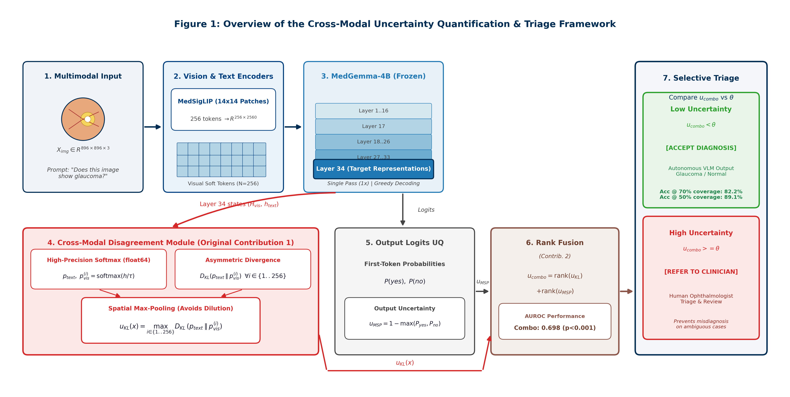
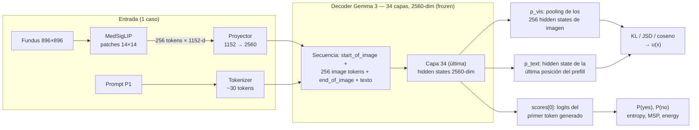
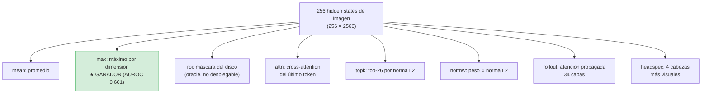

# 04 — Arquitectura Técnica

> **Propósito:** describir con precisión de re-implementación cómo se extrae la señal: la arquitectura de MedGemma-4B, la extracción de representaciones internas, la conversión a distribuciones, las divergencias, las 8 estrategias de pooling, los baselines de igual costo y la señal combinada por ranks. Los detalles de API viven en [05 — Implementación Software](05_Implementacion_Software.md); las trampas numéricas, en [12 — Verificación](12_Verificacion_y_Validacion.md).

[⬅️ 03 — Hipótesis y Diseño Experimental](03_Hipotesis_y_Diseno_Experimental.md) | [➡️ 05 — Implementación Software](05_Implementacion_Software.md)

---

## 4.1 Arquitectura de MedGemma-4B

`google/medgemma-4b-it` (revisión `v1.0.1`, checkpoint con fix del end-of-image token) es un VLM de ~4B parámetros con tres componentes:

1. **Vision encoder (MedSigLIP):** un SigLIP adaptado a imagen médica. La imagen entra a **896×896** px (resize y normalización hechos por el `AutoProcessor`, sin preproceso manual), se divide en patches de 14×14 y produce **256 tokens de imagen** de 1152 dimensiones.
2. **Proyector multimodal:** mapea cada token visual de 1152-dim a **2560-dim**, el espacio del decoder. Los soft tokens de imagen solo existen en 2560-dim *después* del proyector — toda la señal se computa sobre hidden states del **decoder**, nunca sobre salidas del vision encoder.
3. **Decoder (Gemma 3):** 34 capas de transformer decoder-only, causal self-attention, dimensión oculta 2560. Vocabulario: **262.144** entradas de tokenizer; **262.208** filas en la matriz de embeddings (incluye tokens especiales; `<image_soft_token>` = 262.144, `<start_of_image>` = 255.999, `<end_of_image>` = 256.000).

---

## 4.2 Extracción de representaciones internas

$$\theta = \text{cuantil}{1-r}\big(u{\text{combo}}(x)\big)$$

Con `max_new_tokens=1`, `output_hidden_states=True`, `output_scores=True` y greedy decoding bajo `torch.inference_mode()`:

- **`outputs.hidden_states[0]`** es la tupla del prefill (único paso existente con 1 token generado; `hidden_states[1]` sería IndexError). Tiene `num_layers + 1 = 35` entradas: el índice 0 corresponde a los embeddings escalados y el índice `L` a la salida de la capa `L−1` del decoder. Convención congelada: "capa 34" = índice `[34]` de la tupla = última capa.
- **`p_text`** = `hidden_states[0][34][:, -1, :]` — el hidden state de la **última posición del prefill**, es decir, el estado que **condiciona** el primer token de respuesta. Esta elección mantiene el claim single-pass: es el estado exacto desde el que el modelo "habla".
- **`p_vis`** = pooling sobre los hidden states de las **posiciones de imagen** en la misma capa, identificadas por **máscara sobre `image_token_index`** (`input_ids == 262144`) — nunca por slicing fijo `[:, :256, :]`. El sanity check #3 verifica que la máscara marca exactamente 256 posiciones contiguas tras `<start_of_image>`.
- **Logits yes/no:** salen de `outputs.scores[0]` (logits del primer token generado), indexados con los IDs verificados `yes` = 4443, `no` = 1904 (el chat template termina en `<start_of_turn>model\n`, así que el primer token de respuesta **no** lleva espacio inicial).

**¿Por qué la capa 34 y no la 17 o la 26?** En el piloto se descubrió que en las capas intermedias la KL **colapsa numéricamente**: los valores quedan degenerados (casi idénticos para todas las imágenes), porque a esa profundidad las representaciones de imagen y texto aún no están diferenciadas para la tarea. Solo en la capa final — donde la representación ya está orientada a responder la pregunta — la KL varía entre casos ([§7.4](07_Ablaciones_y_Analisis_Profundo.md)).

---

## 4.3 Conversión a distribuciones de probabilidad

Los hidden states son vectores crudos en $\mathbb{R}^{2560}$; para compararlos con divergencias se convierten en distribuciones sobre sus propias dimensiones:

$$p = \exp\big(\mathrm{log\text{-}softmax}(v / \tau)\big), \qquad \text{computado en \texttt{float64}}$$

Dos decisiones numéricas críticas (verificadas en el piloto, ver [§12.3](12_Verificacion_y_Validacion.md)):

1. **float64 obligatorio.** Las *massive activations* de Gemma (valores de magnitud extrema en ciertas dimensiones) colapsan la softmax a distribuciones degeneradas incluso en float32: todo queda en unas pocas dimensiones y la KL se vuelve ruido binario. `F.log_softmax(..., dtype=torch.float64)` resuelve el problema.
2. **Sin normalización previa (ni z-score ni norma L2).** Normalizar los vectores antes de la softmax aplana demasiado las diferencias entre casos: la KL queda ≈ 0 para todas las imágenes y la señal desaparece. Se usa la softmax **cruda** (solo dividida por τ), que preserva las diferencias relativas entre estados de imagen y texto.
3. **Clamp $\varepsilon = 10^{-10}$:** antes de la KL, ambas distribuciones se recortan a un mínimo de $\varepsilon$ para evitar $\log 0$. Esto pone un **techo winsorizador** a la KL en $\ln(1/\varepsilon) = 23.03$ nats (53/129 imágenes quedan en el techo; es por diseño, ver [§12.5](12_Verificacion_y_Validacion.md)).

---

## 4.4 Cálculo de las divergencias

Con $p_{vis}$ y $p_{text}$ ya como distribuciones:

$$D_{KL}(p_{text} \,\Vert\, p_{vis}) = \sum_{i} p_{text,i}\,\ln\frac{p_{text,i}}{p_{vis,i}} \qquad \text{(dirección ganadora)}$$

$$D_{KL}(p_{vis} \,\Vert\, p_{text}) = \sum_{i} p_{vis,i}\,\ln\frac{p_{vis,i}}{p_{text,i}} \qquad \text{(dirección espejo, siempre reportada)}$$

$$JSD = \tfrac{1}{2}D_{KL}(p \Vert m) + \tfrac{1}{2}D_{KL}(q \Vert m),\quad m = \tfrac{p+q}{2} \qquad \text{(simétrica, cota } \ln 2 \approx 0.693\text{)}$$

$$d_{cos} = 1 - \frac{\bar{h}^{(vis)} \cdot h^{(text)}}{\lVert \bar{h}^{(vis)} \rVert \, \lVert h^{(text)} \rVert} \qquad \text{(sobre vectores crudos, sin softmax)}$$

Las **97 variantes** = 4 tipos de divergencia × 8 poolings × 3 temperaturas (96) + la variante `kl_prompt` (imagen vs. texto del prompt, control negativo). Todas se calculan **en la misma pasada**: son re-cortes sobre los mismos hidden states capturados, sin costo de inferencia adicional.

---

## 4.5 Estrategias de pooling (8 variantes)

Los 256 tokens de imagen deben resumirse en un solo vector. El riesgo es la **dilución espacial**: el disco óptico ocupa 5–10% de la imagen ([§2.5](02_Marco_Teorico.md)). Las 8 estrategias evaluadas:

| Pooling | Definición | ¿Desplegable? |
|---|---|---|
| `mean` | Promedio simple de los 256 tokens | Sí |
| `max` | Máximo elemento a elemento (por dimensión) | Sí |
| `roi` | Ponderación por la máscara del disco óptico (redimensionada a la grilla 16×16 de tokens) | **No — oracle** (requiere máscaras externas; solo 69 imágenes las tienen) |
| `attn` | Ponderación por la atención que el último token del prefill deposita en cada token de imagen | Sí |
| `topk` | Promedio de los 26 tokens (~10%) con mayor norma L2 | Sí |
| `normw` | Ponderación de cada token por su norma L2 (softmax de normas, sin parámetros) | Sí |
| `rollout` | Attention Rollout (Abnar & Zuidema, 2020): atención propagada multiplicando las matrices de las 34 capas | Sí |
| `headspec` | Ponderación por las 4 cabezas de atención más "visuales" (mayor masa sobre tokens de imagen) | Sí |

Resultado resumido (detalle en [§7.2](07_Ablaciones_y_Analisis_Profundo.md)): **max > mean > basados en atención**. La atención de un modelo frozen no está alineada con la tarea de glaucoma; el máximo elemento a elemento captura la activación pico sin diluirla.

---

## 4.6 Baselines de igual costo (single-pass, 1×)

De los mismos logits del primer token generado ($\ell_{yes}$, $\ell_{no}$):

$$p_{yes} = \frac{e^{\ell_{yes}}}{e^{\ell_{yes}} + e^{\ell_{no}}}, \qquad H = -p_{yes}\ln p_{yes} - p_{no}\ln p_{no} \quad \text{(entropy)}$$

$$u_{MSP}(x) = 1 - \max(p_{yes}, p_{no}), \qquad u_{energy}(x) = \ln\big(e^{\ell_{yes}} + e^{\ell_{no}}\big) \;\; \text{(−energy)}$$

**Matiz del softmax restringido:** $p_{yes}$ y el MSP son un **score binario sobre solo 2 logits**, no una probabilidad calibrada sobre el vocabulario completo (el baseline SC a T=1.5 reveló masa fuera de yes/no: muestras como "based", "i"). Para ranking/UQ es válido; no debe llamarse "probabilidad calibrada" ([§8.3](08_Discusion_y_Limitaciones.md)).

Nota de equivalencia: con 2 clases, entropy y 1−MSP producen **rankings idénticos** (correlación de Spearman = 1.00), por lo que sus AUROC coinciden exactamente (0.624); energy es un tercer ranking distinto pero correlacionado con MSP (rho = 0.84) — ver `fig6_correlacion_senales.png` en [§6.4](06_Resultados_Experimentales.md).

---

## 4.7 Señal combinada `rank(KL) + rank(1−MSP)` — contribución original del autor

**Motivación.** La KL captura desacuerdo cross-modal (espacio de representaciones internas); el 1−MSP captura duda en la respuesta (espacio de logits). Son señales complementarias por naturaleza: su correlación de Spearman es apenas 0.27 en P1 (0.02 en P4). La KL atrapa errores donde el modelo respondió confiado pero hubo tensión interna imagen↔texto; el MSP atrapa errores donde el modelo vaciló aunque no hubo tensión interna.

**Formulación (sin parámetros):**

$$u_{combo}(x) = \mathrm{rank}\big(u_{KL}(x)\big) + \mathrm{rank}\big(1 - MSP(x)\big)$$

donde $\mathrm{rank}$ es la posición de la imagen $x$ en el orden de cada señal dentro de la cohorte (más alto = más sospechoso). No hay pesos que aprender ni constantes que calibrar — a diferencia de una regresión logística (que probamos y aprendió a ignorar el MSP), esta combinación **no puede sobreajustarse**.

**¿Por qué rank fusion y no suma directa?** Las escalas son incompatibles: la KL vive en ~21–23 nats winsorizados (valores absolutos no portables entre $\varepsilon$/hardware, [§12.5](12_Verificacion_y_Validacion.md)) y 1−MSP en [0, 1] saturado cerca de 0. Sumar los crudos equivaldría a dejar que la KL domine por escala; normalizar introduciría decisiones (y parámetros) adicionales. Los ranks hacen las señales comparables **sin introducir ningún hiperparámetro** y son naturalmente robustos a la winsorización de la KL.

**Originalidad (verificada por búsqueda exhaustiva en la literatura):** esta combinación específica **no ha sido propuesta en ningún paper previo**. La técnica genérica de agregación por ranks existe en information retrieval (Reciprocal Rank Fusion, Cormack et al., 2009), pero su instanciación para fusionar señales de UQ heterogéneas — una del espacio de representaciones internas (KL cross-modal) y otra del espacio de salida (1−MSP) — en VLMs es **nueva y constituye contribución doctoral del autor**. Resultados: AUROC 0.698 frente a 0.661 (KL sola) y 0.624 (MSP solo); Excess-AURC 0.407 frente a 0.670 y 0.732 ([§6.5](06_Resultados_Experimentales.md)).

---

## 4.8 Sanity checks (los 8 checks del piloto)

Antes de la corrida completa, el piloto de 20 imágenes debe pasar 8 sanity checks (todos PASS):

| # | Check | Resultado esperado | Estado |
|---|---|---|---|
| 1 | $KL(p \Vert p)$ con la misma distribución | Exactamente 0 | ✅ |
| 2 | Misma imagen dos veces, mismo prompt | $u(x)$ idéntico (greedy, seed fija) | ✅ |
| 3 | Máscara de image tokens sobre 5 ejemplos | Exactamente 256 posiciones contiguas tras `<start_of_image>` | ✅ |
| 4 | $P(yes) + P(no)$ | ≈ 1.0 (salvo ε numérico) | ✅ |
| 5 | Imagen totalmente negra con P1 | KL visiblemente alta vs. imágenes normales | ✅ |
| 6 | Distribución de $P(yes)$ sobre el dataset | No colapsada en 0 o 1 | ✅ |
| 7 | Conteo en `master_table.csv` | 60 Normal / 69 Pathological = 129; train 77 / val 26 / test 26 | ✅ |
| 8 | Flag `has_annotation_artifact` | Presente en la tabla maestra, conteo por clase reportado | ✅ |

Además, el piloto mide primero la **accuracy base** de MedGemma: si fuera > 85%, se activaría la vigilancia del riesgo "pocos errores" (poca muestra positiva para evaluar UQ). El valor real fue 79.8% (26 errores) — suficiente para la evaluación principal ([§6.1](06_Resultados_Experimentales.md)).

---

[⬅️ 03 — Hipótesis y Diseño Experimental](03_Hipotesis_y_Diseno_Experimental.md) | [➡️ 05 — Implementación Software](05_Implementacion_Software.md)
