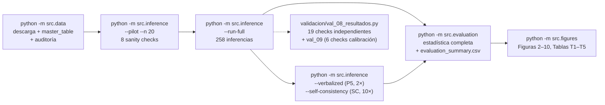

# 05 — Implementación Software

> **Propósito:** documentar el código del pipeline a nivel de re-implementación: stack, estructura del proyecto, responsabilidad de cada módulo, formatos de datos y garantías de reproducibilidad. Los comandos paso a paso están en [10 — Guía de Reproducibilidad](10_Guia_Reproducibilidad.md).

[⬅️ 04 — Arquitectura Técnica](04_Arquitectura_Tecnica.md) | [➡️ 06 — Resultados Experimentales](06_Resultados_Experimentales.md)

---

## 5.1 Stack tecnológico

| Capa | Tecnología | Nota |
|---|---|---|
| Lenguaje | Python 3.10+ | Entorno virtual `.venv` |
| Modelo | `google/medgemma-4b-it` (rev. `v1.0.1`) vía HuggingFace | Requiere licencia HAI-DEF aceptada + `HF_TOKEN` |
| ML framework | PyTorch + `transformers >= 4.51.3` | Obligatorio: API de hidden states válida desde esa versión |
| Dataset | `TheBug95/MM-ODIR-129` (HF, MIT) | Descarga por `huggingface_hub.snapshot_download` (**no** `load_dataset`: el repo no tiene parquet y el visor está roto) |
| Estadística | `scipy >= 1.11`, `scikit-learn >= 1.7` | Bootstrap BCa, DeLong (exploratorio), `jensenshannon` |
| Visualización | Matplotlib / Seaborn | Figuras en inglés |
| Configuración | `config.yaml` + `pyproject.toml` + `requirements.txt` | Instalación editable con `pip install -e .` |
| Hardware | ~16 GB VRAM en bfloat16 | ~6–8 GB en 4-bit (`bitsandbytes`, opcional para Colab T4) |

**Hiperparámetros de diseño** (`config.yaml`): seed 42, `torch_dtype: bfloat16`, `attn_implementation: eager` (reproducibilidad numérica), `device_map: auto`, `max_new_tokens: 1`, greedy (`do_sample: false`), resolución 896, capas `[17, 26, 34]`, temperaturas `[1.0, 2.0, 4.0]`, `epsilon: 1.0e-10`, bootstrap BCa 9.999 remuestreos, nivel de confianza 0.95.

---

## 5.2 Estructura del proyecto

```text
VLM-UQ-Cross-Modal-Phd.-Proposal-/
├── config.yaml                     # Hiperparámetros de diseño + fallback de token IDs
├── pyproject.toml / requirements.txt
├── src/
│   ├── __init__.py
│   ├── config.py                   # Carga config.yaml; resuelve token IDs desde HF (259 líneas)
│   ├── data.py                     # Descarga dataset, master_table.csv, auditoría de artefactos (424)
│   ├── inference.py                # Pipeline MedGemma: single-pass + P5 + SC (1142)
│   ├── uncertainty.py              # 8 estrategias de pooling + heatmaps (467)
│   ├── evaluation.py               # AUROC/AUPRC BCa, Mann-Whitney, H4, AURC, acc-cov, TPR@FPR, calibración (812)
│   ├── figures.py                  # Figuras 2–10 y tablas T1–T5 (819)
│   └── generate_pipeline_fig.py    # Diagrama del pipeline (fig1)
├── data/
│   ├── mm_odir_129/                # Dataset (annotations.json, split.json, train/val/test/)
│   └── master_table.csv            # 129 filas × 15 columnas
├── results/
│   ├── results_full.csv            # CSV central, formato largo (~23.600 filas)
│   ├── results_pilot.csv           # Piloto de 20 imágenes
│   ├── results_verbalized.csv      # Baseline P5 (129 filas)
│   ├── results_self_consistency.csv# Baseline SC (100 filas: 50 imgs × 2 prompts)
│   ├── evaluation_summary.csv      # Resumen estadístico con BCa CI
│   ├── acc_cov_P1_winner.csv       # Accuracy-coverage (ganadora y combinación, P1 y P4)
│   ├── verificacion_manual_kl.csv  # KL recomputada manualmente en otra GPU
│   └── analisis_*.py / verificacion_zona_verde.py  # Scripts de análisis y verificación
├── figures/                        # Figuras 2–10, heatmaps, tablas T1–T5 (CSV)
├── validacion/
│   ├── val_01_environment.py … val_07_pilot.py   # Validaciones pre-implementación
│   ├── val_08_resultados.py        # 19 checks independientes del pipeline (215 líneas)
│   └── val_09_calibracion.py       # 6 checks sintéticos del código de calibración (140)
├── Definicion_Experimental_Minima_BIP2026.md   # Especificación congelada (v2)
├── Reporte_Experimento_BIP2026.md  # Reporte consolidado (fuente primaria de números)
├── Informe_Investigacion_BIP2026.tex   # Informe de investigación extendido (LaTeX)
├── Analisis_Dataset_MM_ODIR_129.md / research/ # Análisis del dataset + dossier (10 dims)
└── Documentacion/                  # ← Esta documentación
```

---

## 5.3 Módulo por módulo

### `src/config.py` — configuración central

`Config` carga `config.yaml` (con acceso tipo diccionario punteado `DotDict`), resuelve rutas relativas a la raíz del proyecto (`_project_root()`), y — con `resolve_ids=True` — intenta **sobreescribir los token IDs de fallback** (yes/no/image tokens) cargando el tokenizer real de HuggingFace; sin acceso, usa los valores congelados del YAML (`yes` = 4443, `no` = 1904, `image_soft_token` = 262.144, `start_of_image` = 255.999, `end_of_image` = 256.000). También fija las semillas (`random`, `numpy`, `torch`, `cudnn.deterministic`).

### `src/data.py` — datos y tabla maestra

- `download_dataset()`: `snapshot_download(repo_id="TheBug95/MM-ODIR-129", repo_type="dataset")` a `data/mm_odir_129`.
- `load_annotations()` / `load_split_map()`: leen `annotations.json` (129 entradas) y `split.json` (asignación de splits). ⚠️ `split.json` contiene `doctor_name` (PII del anotador): **nunca** se copia a la tabla maestra ni a artefactos.
- `parse_filename()` (`{patient_id}_{eye}.jpg`), `extract_gradings()` (los 7 gradings ordinales de `locs_data.glaucoma`; el campo del diseño `cdr_grade` corresponde a `cup_to_disc_ratio` en el dataset), `check_masks()`.
- **Auditoría de artefactos (Paso 1.5):** `_detect_black_marker()` detecta regiones negras pequeñas de alto contraste (como la flecha quemada de `1281_right.jpg`) y `audit_annotation_artifacts()` genera el flag `has_annotation_artifact` por imagen.
- `build_master_table()` produce `data/master_table.csv` y `sanity_checks()` valida los conteos (60N/69P, splits 77/26/26, flag presente).

### `src/inference.py` — pipeline de inferencia

- Utilidades numéricas: `to_distribution()` (softmax cruda/τ en **float64**, sin normalización previa), `kl_div()` (con clamp `eps`), `jsd()` (`jensenshannon` **al cuadrado** — scipy devuelve distancia).
- Clase `MedGemmaInference`: carga `Gemma3ForConditionalGeneration` + `Gemma3Processor`; ejecuta la pasada single-pass (prefill + 1 token greedy) capturando hidden states, scores, y opcionalmente atenciones (backend eager). Extrae `p_text` (última posición del prefill), hidden states de imagen por máscara de `image_token_index`, y logits yes/no por IDs.
- `to_long_format()`: emite **todas las 97 variantes** (KL/JSD/coseno × poolings × τ + kl_prompt) más baselines en formato largo — las ablaciones son análisis sobre tabla, no re-cómputo.
- `append_result()`: **escritura incremental** (append) para reanudabilidad.
- Runners: `run_pilot()` (con los 8 sanity checks), `run_full()` (258 inferencias), `run_self_consistency()` (50 imgs × 10 muestras × 2 prompts, temperatura por flag `--sc-temp`, default 1.5), `run_verbalized()` (P5, 129 inferencias extra), `run_with_seeds()` (repeticiones con columna `seed`).

### `src/uncertainty.py` — poolings y atención

`mean`/`max` (inline), `roi_weighted_pooling()` + `compute_roi_weights()` (oracle con máscaras `_disc`), `attention_weighted_pooling()` + `compute_attention_weights()` (cross-attention del último token), `topk_pooling()` (k = 26), `norm_weighted_pooling()`, `attention_rollout()` (Abnar & Zuidema, 2020), `head_specific_attention()` (4 cabezas más visuales), `cosine_distance()`, y `generate_attention_heatmap()` (los 3 heatmaps de la Figura en [§6.8](06_Resultados_Experimentales.md)).

### `src/evaluation.py` — estadística

Sobre el formato largo (`load_results()` normaliza las filas `kl_prompt_L34` que quedaron con layer/τ desalineados en el CSV — fix pendiente en inference): `signal_frame()`, `baseline_values()`, `rank_combination_frame()` (la combinación por ranks), `bootstrap_ci()` (BCa 9.999), `mann_whitney_effect()`, `spearman_h4()` (con permutación), `sensitivity_at_specificity()`, `accuracy_coverage()`, `aurc()` / `aurc_oracle()` / `excess_aurc()` (selective prediction), `tpr_at_fpr()` (TPR a FPR fijos 5/10/20%), la suite de calibración estilo FUSE §5.2 — `platt_calibrate()` (sigmoide 1-feature $u \rightarrow P(error)$, ajustada SOLO en train), `calibration_bins()` (equiprobables), `expected_calibration_error()` (+ sensibilidad con 5 bins), `calibration_correlations()` (Pearson/Spearman), `calibration_analysis()` (Brier, IC bootstrap percentil 95%, flag `in_sample`) —, `select_winner()` (solo en train, excluye poolings oracle) y `analyze_frame()`. Guarda `results/evaluation_summary.csv`.

### `src/figures.py` — figuras y tablas

`fig2_boxplot()` (por señal), `fig3_roc_pr()`, `fig4_accuracy_coverage()` (con AURC/Excess por señal), `fig5_quadrants()` (con transcripciones clínicas), `fig6_correlation()` (Spearman entre señales), `fig7_tabla_t4_costo()` (scatter costo vs. AUROC + T4), `fig8_verbalized()`, `fig9_sc_boxplots()`, `fig10_reliability()` (reliability diagram de calibración, Platt en train + bins equiprobables), `table_t1/t2/t3()` y `table_t5_calibracion()` (T5: discriminación + calibración lado a lado, espejo de FUSE Table 1). Reusa helpers de `evaluation`; la ganadora se elige en train o se pasa con `--signal`.

### Diagrama de flujo del pipeline



---

## 5.4 Formato de datos

### `data/master_table.csv` (129 filas × 15 columnas)

```
image_filename, patient_id, eye, label (0=Normal, 1=Pathological), split,
transcription, cdr_grade, neuroretinal_rim, disc_hemorrhage,
peripapillary_atrophy, rnfl_defect, disc_pallor, vessel_changes,
has_masks, has_annotation_artifact
```

Notas: `cdr_grade` es ordinal entero 0–4 (no continuo), no nulo en 70 muestras (69 Pathological + 1 Normal); H4 corre sobre los 69 patológicos. `patient_id` es sensible: no exponerlo públicamente.

### `results/results_full.csv` (formato largo, ~23.600 filas)

Una fila por **imagen × prompt × variante**:

```
image_filename, patient_id, prompt_id (P1|P4), split,
logit_yes, logit_no, p_yes, pred (0|1), entropy_answer, msp_answer, energy_answer,
label (0|1), correct (0|1), inference_ms,
signal_type (kl_v_t|kl_t_v|jsd|cosine|kl_prompt_L34),
layer (solo 34; las capas 17/26 colapsan numéricamente),
tau (1.0|2.0|4.0),
pooling (mean|max|roi|attn|topk|normw|rollout|headspec),
value
```

Las columnas de observación (logits, baselines, label, `correct`) se repiten dentro de cada observación; las señales viven en `value`. Todas las variantes se guardan en la **misma pasada**.

### `results/evaluation_summary.csv`

Una fila por `prompt × signal × split` con: `n, n_errors, auroc, auroc_ci_low/high, auprc(+CI), aurc, excess_aurc_norm, mannwhitney_p, effect_size_r, sens_80spec, tpr_fpr05/10/20, ece(+CI), cal_pearson, cal_spearman, brier, calibration_in_sample`. Es la fuente canónica de los números reportados en [06](06_Resultados_Experimentales.md).

### CSVs de baselines

- `results_verbalized.csv` (129 filas): `image_filename, patient_id, split, label, correct, answer, pred, verbalized_conf, u_verbalized, parse_ok, raw_response, inference_ms`. De las 129 respuestas, **118 declaran 95 y 11 declaran 90** — ningún otro valor.
- `results_self_consistency.csv` (100 filas: 50 imgs × 2 prompts): `self_consistency_frac_yes, sc_frac_no, sc_frac_other, self_consistency_entropy (3-vías), sc_entropy_binary, sc_samples (los 10 tokens muestreados), label`.

---

## 5.5 Reproducibilidad

- **Semillas:** `random.seed(42)`, `np.random.seed(42)`, `torch.manual_seed(42)`; `cudnn.deterministic = True`. Pasada principal **greedy** (determinista por construcción). Repeticiones multi-semilla disponibles con `--seeds`.
- **Backend de atención `eager`** en la corrida principal (reproducibilidad numérica; sdpa introduce ruido ≈ 0.4 nats en KL, sin efecto en el ranking).
- **Registro de versiones** de `torch`, `transformers`, Python y GPU en cada corrida.
- **Verificación cross-GPU:** los logits son **bitwise idénticos** entre dos GPUs distintas (0/129 predicciones cambian); el ranking KL es estable (Spearman 0.964) — detalles en [§12.4](12_Verificacion_y_Validacion.md).
- **`epsilon` fijo entre corridas:** un `eps` distinto desplaza TODOS los valores de KL en una constante ($\ln$ del ratio de eps); no comparar valores absolutos entre corridas con eps distinto.
- **Costo de la corrida:** ~4.5 s por imagen; 258 inferencias ≈ 10–20 min de GPU; P5 ≈ 5 min adicionales; SC (500 muestras × 2 prompts) es la parte más larga.

---

[⬅️ 04 — Arquitectura Técnica](04_Arquitectura_Tecnica.md) | [➡️ 06 — Resultados Experimentales](06_Resultados_Experimentales.md)
