# 06 — Resultados Experimentales

> **Este es el documento central de la documentación.** Reporta todos los resultados con datos reales verificados (fuente canónica: `results/evaluation_summary.csv` y `Reporte_Experimento_BIP2026.md`), con las figuras del paper embedidas. Las ablaciones detalladas están en [07](07_Ablaciones_y_Analisis_Profundo.md); la interpretación crítica y las limitaciones, en [08](08_Discusion_y_Limitaciones.md).

[⬅️ 05 — Implementación Software](05_Implementacion_Software.md) | [➡️ 07 — Ablaciones y Análisis Profundo](07_Ablaciones_y_Analisis_Profundo.md)

---

## 6.1 Accuracy base de MedGemma

MedGemma-4B, en modo zero-shot con el prompt P1, clasifica correctamente **103 de 129 imágenes: accuracy = 79.8%**. Se equivoca en **26 casos** — esa es la muestra positiva sobre la que se evalúa toda la UQ. La distribución de $P(yes)$ no está colapsada (sanity check #6), pero sí está muy concentrada: la mediana de $p_{yes}$ entre las predichas "yes" es ≈ 0.9999 — el modelo casi nunca duda en su output, lo que ya anticipa la utilidad limitada de los baselines basados en logits (entropy/MSP) y la necesidad de mirar dentro del modelo.

Contexto: este 79.8% cae en el escenario "aceptable" previsto por el análisis de riesgo del diseño (26 errores dan poder suficiente para evaluar la alarma; el escenario temido era accuracy > 85% → ~13 errores).

---

## 6.2 Selección de la variante ganadora (SOLO en train)

Las 97 variantes se ordenaron por AUROC **únicamente sobre el split train (77 imágenes)**, excluyendo los poolings oracle (roi). Top-10 en train (datos de `figures/tabla_t2_ablaciones.csv`):

| #   | Variante                      | AUROC (train) | AUROC (129, referencia) |
| --- | ----------------------------- | ------------- | ----------------------- |
| 1   | **kl_t_v, L34, τ=1.0, max** ★ | **0.728**     | 0.661                   |
| 2   | kl_v_t, L34, τ=1.0, max       | 0.619         | 0.566                   |
| 3   | kl_t_v, L34, τ=2.0, max       | 0.591         | 0.578                   |
| 4   | jsd, L34, τ=2.0, max          | 0.557         | 0.530                   |
| 5   | kl_v_t, L34, τ=2.0, max       | 0.556         | 0.518                   |
| 6   | jsd, L34, τ=4.0, max          | 0.550         | 0.540                   |
| 7   | kl_v_t, L34, τ=4.0, max       | 0.540         | 0.497                   |
| 8   | kl_v_t, L34, τ=1.0, topk      | 0.539         | 0.557                   |
| 9   | kl_v_t, L34, τ=1.0, attn      | 0.539         | 0.524                   |
| 10  | kl_v_t, L34, τ=1.0, normw     | 0.535         | 0.513                   |

**Congelada:** `kl_t_v_L34_tau1.0_max` — KL(texto‖imagen), capa 34, τ = 1.0, pooling max. La brecha train (0.728) → cohorte (0.661) es la esperable "maldición del ganador" y se cuantifica honestamente con Monte Carlo CV en [§6.9](#69-generalización-valtest-y-monte-carlo-cv).

---

## 6.3 Resultados principales (H1)

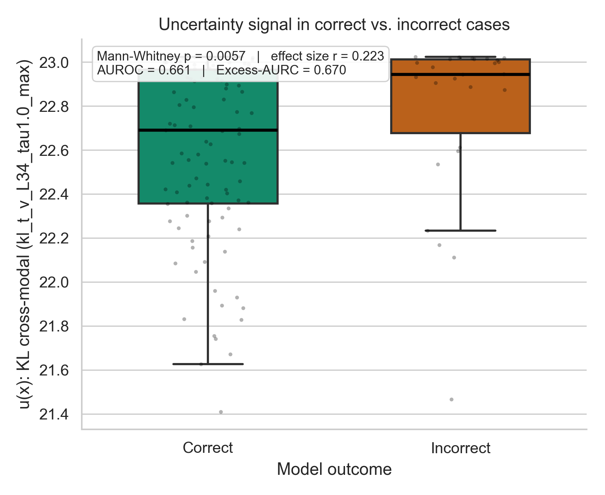

La señal KL cross-modal es **significativamente mayor en los errores que en los aciertos**:

| Métrica | Valor |
|---|---|
| AUROC | **0.661** [0.522, 0.772] (BCa 95%, 9.999 remuestreos) |
| AUPRC | 0.329 [0.183, 0.478] |
| AURC | 0.1425 — Excess-AURC: 0.670 |
| Mann-Whitney U | p = **0.0057**, effect size r = 0.223 |
| Sensitivity @ 80% Specificity | 0.423 |

**H1: VERIFICADA.** El IC excluye 0.5 (evidencia fuerte) y la estimación puntual cumple la meta de diseño (≥ 0.65). Con 26 errores, el AUPRC baseline (azar) sería 26/129 ≈ 0.202; el 0.329 observado duplica esa base.

**Tabla T1 (resultados principales, P1, N = 129, 26 errores):**

| Señal | AUROC | AUPRC | AURC | Excess-AURC ↓ | Sens@80%Spec | Costo |
|---|---|---|---|---|---|---|
| Accuracy del modelo base: 0.798 | — | — | — | — | — | — |
| **KL cross-modal (kl_t_v_L34_tau1.0_max)** | **0.661** | **0.329** | **0.1425** | **0.670** | **0.423** | 1× |
| KL v→t (espejo, kl_v_t_L34_tau1.0_max) | 0.566 | 0.293 | 0.1657 | 0.800 | 0.308 | 1× |
| Entropy | 0.624 | 0.277 | 0.1543 | 0.736 | 0.385 | 1× |
| 1 − MSP | 0.624 | 0.277 | 0.1543 | 0.736 | 0.385 | 1× |
| Energy | 0.560 | 0.242 | 0.1830 | 0.896 | 0.308 | 1× |
| **rank(KL) + rank(1−MSP)** | **0.698** | **0.375** | **0.0955** | **0.407** | 0.308 | 1× |

---

## 6.4 Comparación con baselines de igual costo (H2)

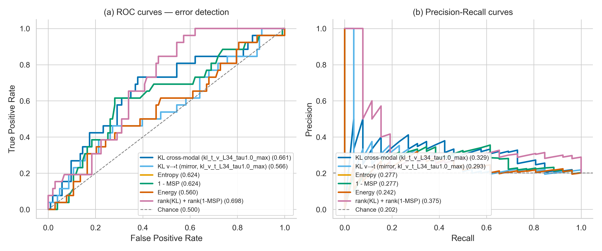

| Señal (1×) | AUROC | AUPRC | Mann-Whitney p |
|---|---|---|---|
| **KL cross-modal (nuestra)** | **0.661** | **0.329** | **0.0057** |
| Entropy | 0.624 | 0.277 | 0.0258 |
| 1 − MSP | 0.624 | 0.277 | 0.0258 |
| Energy | 0.560 | 0.242 | 0.1745 |
| **rank(KL) + rank(1−MSP)** | **0.698** | **0.375** | **0.00096** |

**H2: PARCIALMENTE VERIFICADA.** La KL supera a los tres baselines 1× en AUROC (+0.037 sobre MSP/entropy, +0.101 sobre energy), en AUPRC y en significancia, pero la ventaja sobre 1−MSP es **modesta**. Lectura honesta: la KL no reemplaza a la confianza del modelo — **la complementa** ([§6.5](#65-señal-combinada-h3--contribución-original-del-autor)).

**Correlación entre señales** (Spearman; figura siguiente): KL⊥MSP = **0.27** (complementarias), KL⊥energy = −0.01 (independientes), entropy≡MSP = 1.00 (la misma señal — rankings idénticos con 2 clases), energy–MSP = 0.84 (redundantes: por eso energy no aporta).

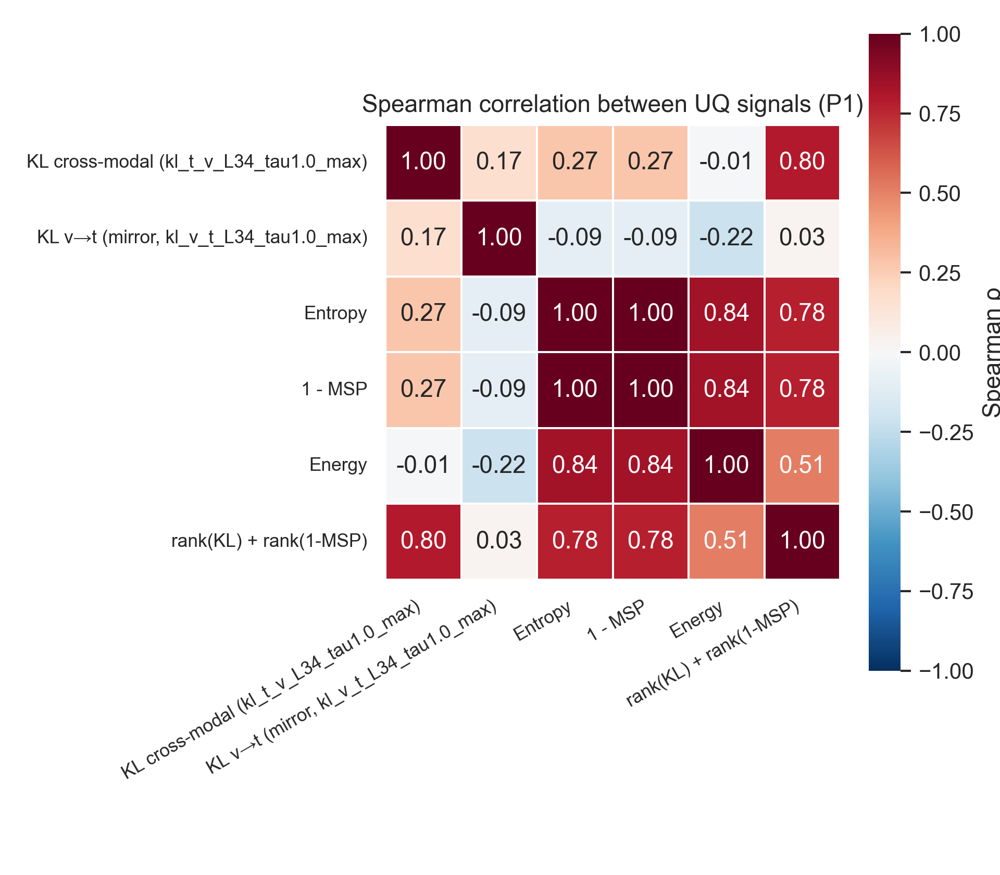

Boxplots individuales de cada baseline y de la combinación (errores vs. aciertos):

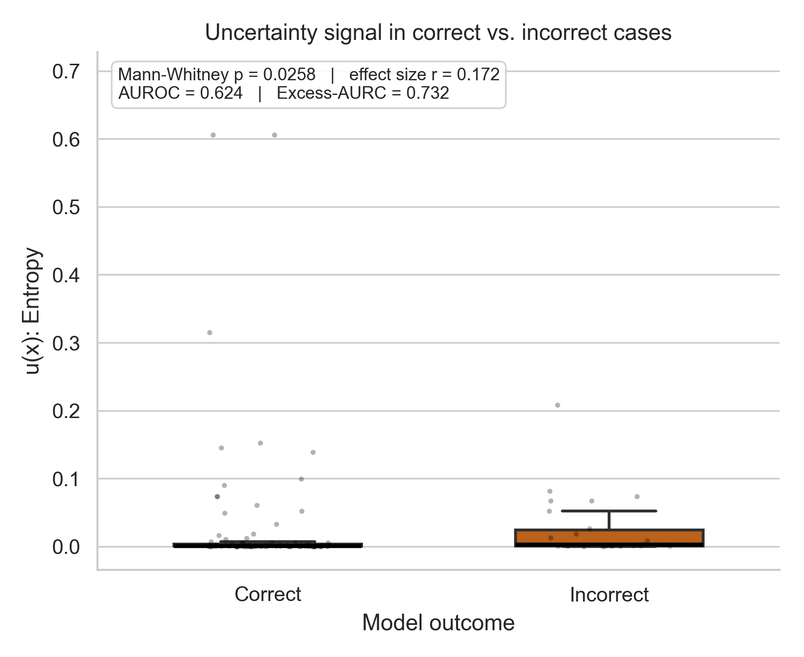
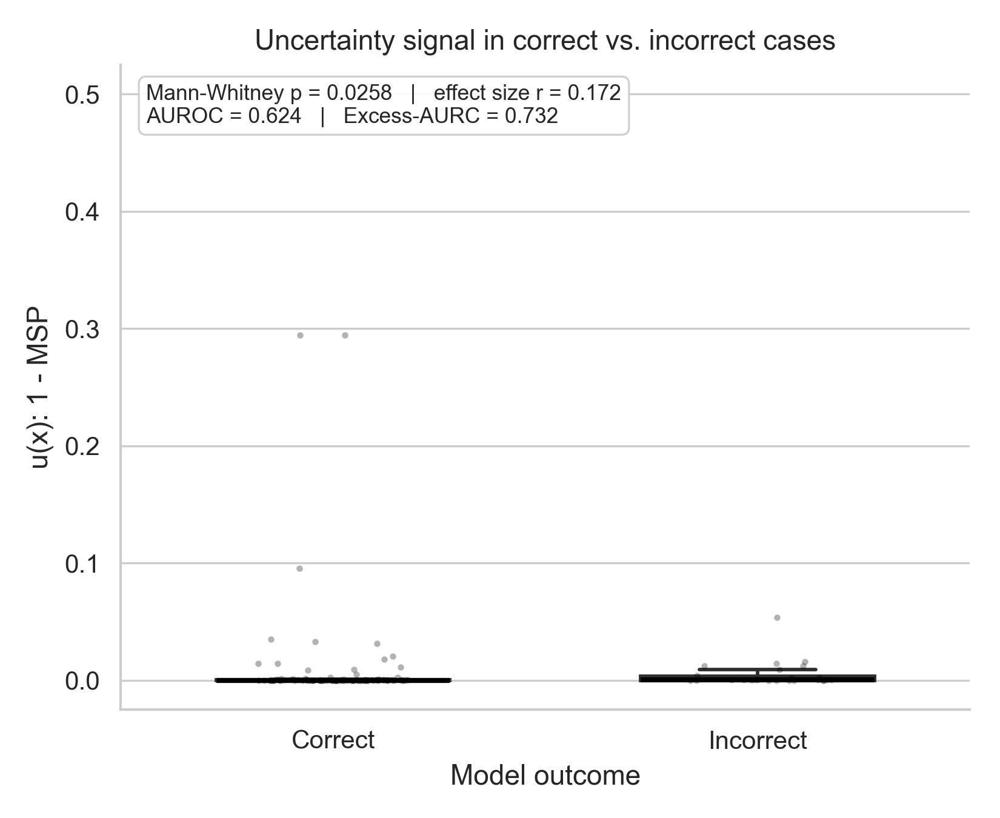
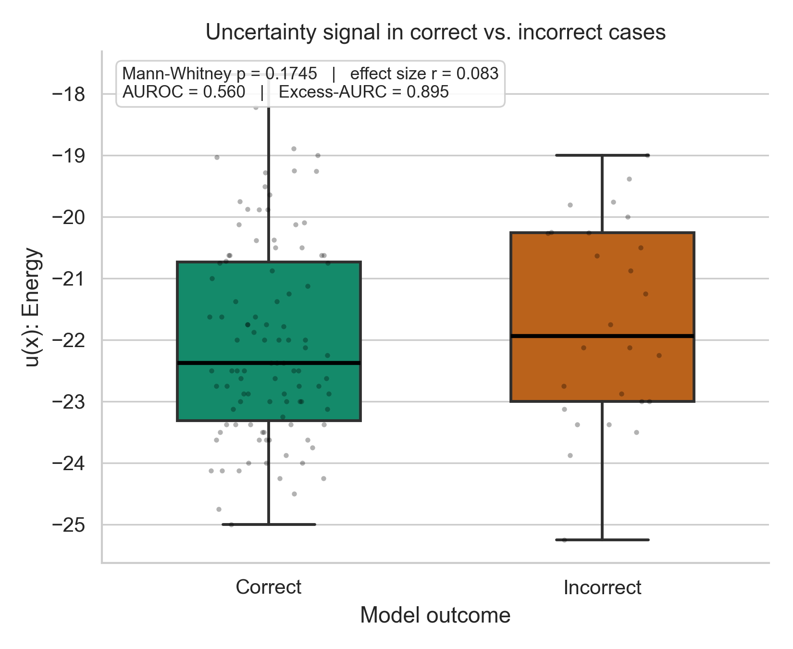
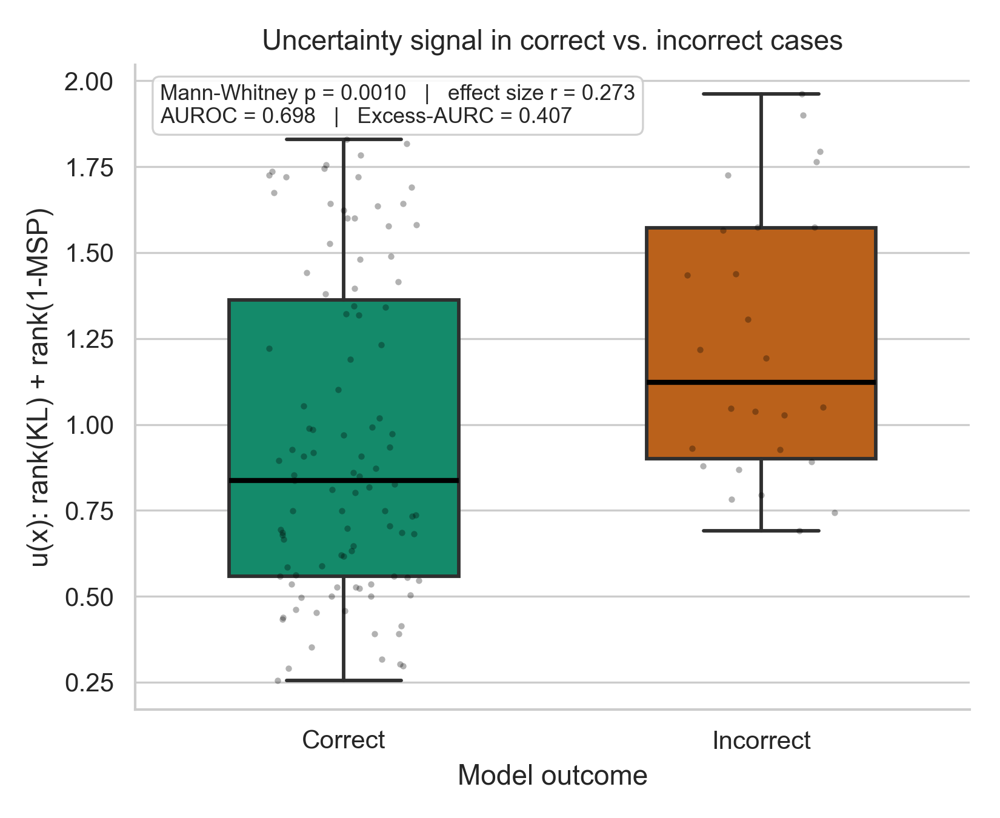

---

## 6.5 Señal combinada (H3) — contribución original del autor

$$u_{combo}(x) = \mathrm{rank}\big(KL(x)\big) + \mathrm{rank}\big(1 - MSP(x)\big)$$

| Evaluación | AUROC |
|---|---|
| **Combinación (P1, 129 imágenes)** | **0.698** [0.596, 0.787], p = 0.00096 |
| — KL sola (comparación) | 0.661 [0.522, 0.772] |
| — 1−MSP solo (comparación) | 0.624 [0.491, 0.739] |
| Monte Carlo CV, 200 splits (KL congelada) | 0.698 ± 0.062 |
| Monte Carlo CV, 200 splits (re-selección anidada de la KL) | 0.648 ± 0.087 |
| Combinación en P4 | 0.654 [0.539, 0.754] |

Mejora de **+5.5% AUROC sobre la KL sola** y **+11.9% sobre 1−MSP solo**, con Excess-AURC 0.407 (vs. 0.670 y 0.732) y precisión en la cabeza de la lista de derivación muy superior (ver [§6.6](#66-accuracy-coverage-aplicación-clínica-y-zona-verde)).

**Originalidad — se enfatiza explícitamente:** esta fusión parameter-free por ranks de una señal del espacio de representaciones internas (KL cross-modal) con una señal del espacio de salida (1−MSP) es una **contribución original del autor, sin precedente en la literatura**. La técnica genérica de rank aggregation proviene de information retrieval (Cormack et al., 2009), pero su instanciación para combinar señales de UQ heterogéneas en VLMs es nueva, verificado por búsqueda exhaustiva.

**Complementariedad empírica:** con correlación Spearman de apenas 0.27 (P1), las dos señales son "testigos que vieron cosas distintas": la KL detecta errores con respuesta sobreconfiada pero tensión interna imagen↔texto; el MSP detecta errores donde el modelo vaciló sin tensión interna. La suma de ranks premia a quien es sospechoso para *al menos una* de las dos, y al operar sobre posiciones es inmune a la incompatibilidad de escalas (KL ~22–23 nats winsorizados vs. MSP en [0,1]) que invalida la suma directa ([§4.7](04_Arquitectura_Tecnica.md)).

**Advertencia honesta:** con N = 129, el IC de la combinación se solapa con el de la KL sola; se reporta como **análisis exploratorio (H3 verificada en ese carácter)**. La señal primaria del estudio sigue siendo la KL congelada, y la combinación demuestra que la señal cross-modal aporta información que la confianza de salida no tiene.

---

## 6.6 Accuracy-Coverage (aplicación clínica) y zona verde

### ¿Qué es θ (theta)? El umbral de triage explicado con la fila de pacientes

Toda la idea cabe en una imagen mental: **la fila**. Ordenamos las 129 imágenes de **menos a más incierto** según u(x):

```
posición:  1                                          129
           |-------------------------------------------|
           más confiable                        más sospechoso
```

- La **posición 1** es la imagen sobre la que el sistema está más seguro; la **129**, la más sospechosa.
- Los 26 errores del modelo **no** están repartidos parejo: se amontonan hacia el final de la fila. Eso es exactamente lo que hace útil a la señal.

**θ es simplemente el punto donde trazamos la raya en esa fila:** todo caso con u(x) **mayor** que θ se deriva al oftalmólogo; todo caso por debajo lo responde el modelo solo.

**Ejemplo pequeño (6 imágenes, 2 errores E y F):**

| imagen | u(x) | posición | realidad |
|---|---|---|---|
| A | 0.32 | 1 | correcta |
| B | 0.55 | 2 | correcta |
| C | 0.69 | 3 | correcta |
| D | 1.10 | 4 | correcta |
| E | 1.56 | 5 | **ERROR** |
| F | 1.90 | 6 | **ERROR** |

Con θ = 1.10 (regla: u > θ se deriva): A–D las responde el modelo (todas correctas → accuracy 100% en lo retenido) y E, F van al doctor (los 2 errores capturados). Sin el corte, el modelo acertaba 4/6 = 66.7%; con el corte, 4/4 = 100%.

**Los valores reales de θ en nuestra cohorte (P1, u_combo, N=129):**

| Decisión de triage | θ (punto de corte) | Accuracy en lo retenido |
|---|---|---|
| Derivar el 10% más incierto | 1.721 (percentil 90) | 81.9% |
| Derivar el 20% | 1.566 (percentil 80) | 81.6% |
| Derivar el 30% | 1.318 (percentil 70) | 82.2% |
| Derivar el 50% | 0.895 (percentil 50) | **89.1%** |
| **Zona verde** (auto-responder la cola) | 0.686 (~percentil 30) | **100%** (39 casos, en esta cohorte) |

Cómo leer la primera fila: las 13 imágenes más inciertas (10% de 129) van al doctor; quedan 116; de esas, el modelo acierta el 81.9%. Como la base era 79.8%, esas 13 derivadas contenían 5 de los 26 errores: el 10% de la fila atrapó el 19% de los errores. Y derivando el 50%, 19 de los 26 errores (73%) quedan del lado del doctor.

**¿Por qué θ se expresa como percentil y no como un número fijo?** Porque el valor absoluto de u(x) solo tiene sentido relativo a la fila de esta cohorte (los nats absolutos de la KL dependen del `epsilon` y del hardware, ver [§8.3](08_Discusion_y_Limitaciones.md)). Lo que se puede llevar a pacientes nuevos es la **regla** ("derivo el 10% más incierto de los que lleguen"), no el número 1.721. Además, por protocolo, θ se fija con el split de train y se reporta congelado.

**¿Cómo se elige θ en la práctica?** Tres criterios legítimos: (a) **capacidad clínica** — cuántos casos puede revisar el especialista; (b) **especificidad objetivo** — p. ej. "alarmar como máximo al 20% de los casos correctos" (el Sens@80%Spec de la Tabla T1); (c) **esquema de 3 zonas con dos umbrales** — θ_bajo ≈ percentil 30 (auto-responder, la zona verde) y θ_crítico ≈ percentil 80–90 (derivación prioritaria), dejando la zona intermedia para pruebas confirmatorias (OCT, campo visual).

---

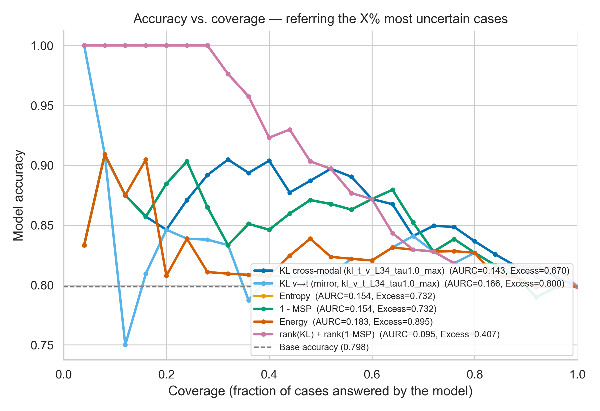

Si el sistema deriva al oftalmólogo el X% más incierto y auto-responde el resto:

| Cobertura (retenidos) | Accuracy KL | Accuracy combinación | n retenidos |
|---|---|---|---|
| 100% | 79.8% | 79.8% | 129 |
| 95% | 80.3% | 82.0% | 122 |
| 90% | 81.0% | 81.9% | 116 |
| 80% | 83.5% | 81.6% | 103 |
| 70% | 84.4% | 82.2% | 90 |
| 50% | 89.1% | 89.1% | 64 |
| 30% | — | **100%** | 39 |

Lectura operativa: derivando el 50% más incierto, la accuracy del 50% que el modelo responde solo sube de 79.8% → **89.1%** (con cualquiera de las dos señales).

### Zona verde (hallazgo clínico clave)

Verificado recomputando desde el CSV en `results/verificacion_zona_verde.py`:

- Los **39 casos menos inciertos de la combinación (30.2% de la cohorte) son TODOS correctos**. El primer error aparece en la **posición 40** del ranking.
- Las posiciones de los 26 errores en el ranking: [40, 46, 50, 51, 60, 62, 63, 69, 70, 78, 79, 80, 81, 85, 86, 89, 97, 98, 103, 104, 105, 119, 123, 125, 128, 129].
- **Advertencias obligatorias:** (a) la frontera es **suave** (Δu = 0.004 entre las posiciones 39 y 40 — no es un umbral robusto); (b) la medida es **in-sample**: el IC 95% de la tasa de error en la zona llega hasta ~7.7% por la regla de tres (0/39 éxitos).

**Lectura clínica de 3 zonas:** auto-responder la **cola** (~30% de los casos, sin errores en esta cohorte), derivar la **cabeza** (los ~7 más inciertos tienen 57% de precisión de error — casos de altísima prioridad) y mandar la **zona gris intermedia** al especialista en flujo normal.

## 6.6b AURC / Excess-AURC (segunda métrica)

El AURC (área bajo la curva riesgo-cobertura; Geifman & El-Yaniv, 2017) integra el error del modelo sobre **todos** los niveles de derivación: es la métrica de selective prediction que mejor refleja el despliegue clínico. El Excess-AURC lo normaliza: **0 = oracle, 1 = azar**, menor = mejor.

| Señal | AURC | Excess-AURC ↓ |
|---|---|---|
| **Combinación rank(KL)+rank(1−MSP)** | **0.0955** | **0.407** |
| KL cross-modal | 0.1425 | 0.670 |
| KL v→t (espejo) | 0.1657 | 0.800 |
| Entropy / 1−MSP | 0.1543 | 0.736 |
| Energy | 0.1830 | 0.896 |

**El AURC amplifica el veredicto sobre la combinación:** 0.407 vs. 0.670 de la KL sola — un **39% más cerca del oracle**. El AURC premia acertar en la cabeza de la lista de derivación, que es exactamente donde la combinación es fuerte (57% de precisión en los 7 casos más inciertos vs. 29% de la KL sola). **Concordancia entre métricas:** Spearman(AUROC, Excess-AURC) = −0.51 sobre las 97 variantes — se correlacionan moderadamente pero no son redundantes: AUROC evalúa el ranking global, AURC los puntos operativos de triage. Las dos coinciden en elegir a la combinación como #1.

---

## 6.7 Análisis cualitativo: los cuatro cuadrantes

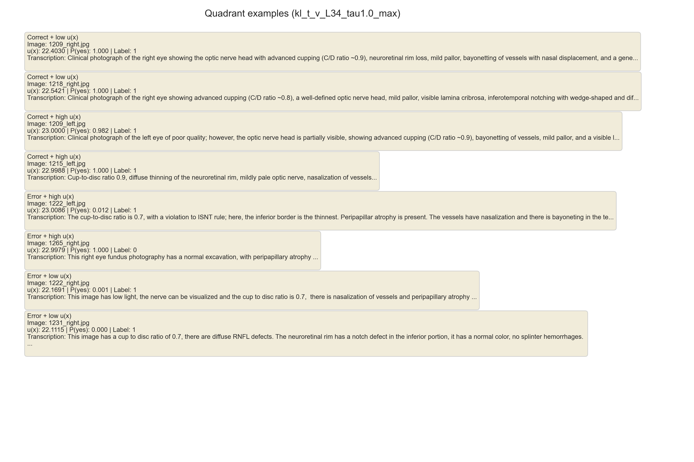

Cruza `correct` × $u(x)$ (alto/bajo) con ejemplos reales y la transcripción del oftalmólogo como referencia experta:

- **Correcto + baja u:** el caso típico — imagen clara, respuesta anclada. La cola auto-respondible.
- **Correcto + alta u:** falsos positivos de la alarma — casos visualmente ambiguos (copete fisiológico, miopía) que el modelo resuelve bien pero con tensión interna. Costo: derivaciones innecesarias.
- **Error + alta u:** el cuadrante de oro — la alarma atrapa al modelo equivocándose (p. ej., responde "no" seguro ante un disco con excavación patológica).
- **Error + baja u:** los errores más peligrosos — sobreconfianza total. En esta cohorte son minoría (de ahí la zona verde), pero existen y motivan la prudencia del esquema de 3 zonas.

---

## 6.8 Heatmaps de atención

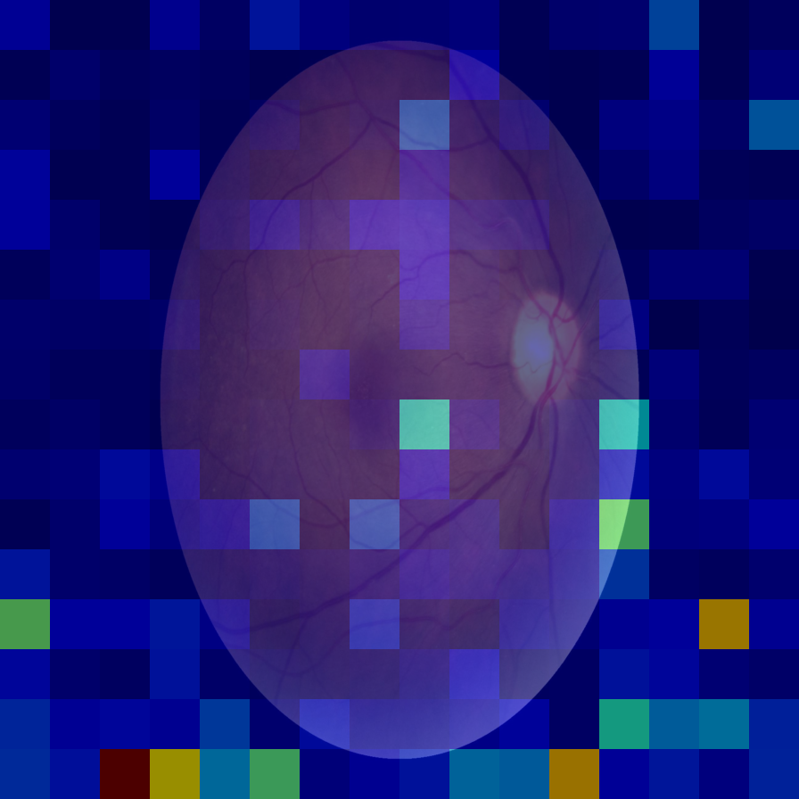
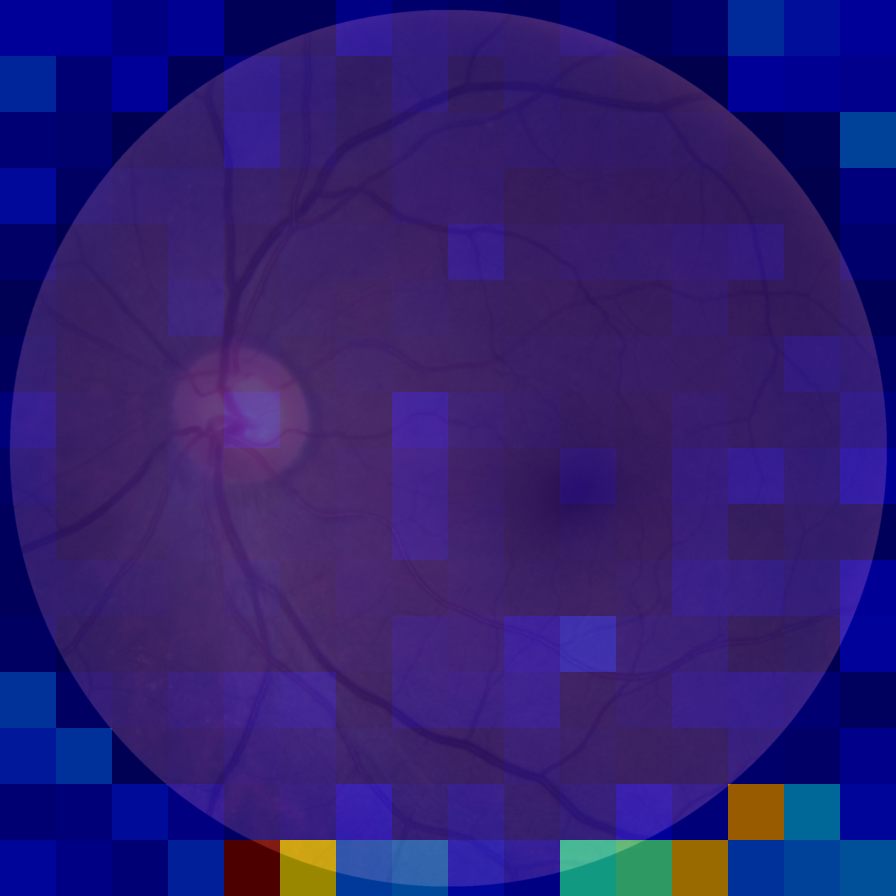
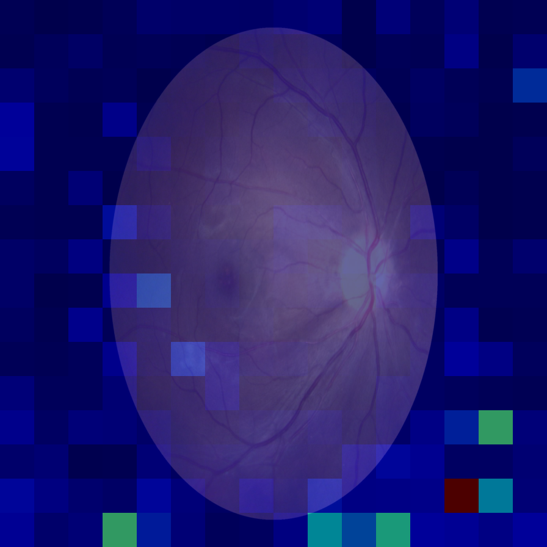

Heatmaps de la atención del último token del prefill sobre los 256 tokens de imagen (remapeados a la grilla 16×16 y superpuestos al fundus), para tres casos reales. Lectura: el modelo distribuye atención sobre regiones amplias del fondo, con foco frecuente en la zona del disco pero sin exclusividad — consistente con el hallazgo cuantitativo de que los poolings guiados por atención (`attn` AUROC 0.479, `rollout` 0.533) rinden **peor** que `max` ([§7.2](07_Ablaciones_y_Analisis_Profundo.md)): la atención del modelo frozen no está alineada con la tarea. **Limitación declarada:** los heatmaps no fueron validados cuantitativamente contra las segmentaciones ground truth de copa/disco ([§8.3](08_Discusion_y_Limitaciones.md)).

---

## 6.9 Generalización: val+test y Monte Carlo CV

| Evaluación | AUROC |
|---|---|
| val+test oficial (52 imgs, **solo 6 errores**) | 0.569 [0.200, 0.938] — sin poder estadístico |
| Monte Carlo CV (200 splits estratificados), **selección anidada** (re-seleccionar la variante en cada train fold) | 0.581 ± 0.116 |
| Monte Carlo CV, **variante congelada** en los mismos test folds | 0.660 ± 0.071 |
| Combinación por ranks, KL congelada | 0.698 ± 0.062 |
| Combinación por ranks, re-selección anidada | 0.648 ± 0.087 |

**Discusión honesta:** el desempeño real de la KL sola en pacientes nuevos está probablemente en **~0.58–0.66** — el 0.661 de la cohorte completa es optimista por la maldición del ganador (la variante se eligió porque rindió bien). La **combinación es la señal más robusta entre splits**: mantiene 0.648–0.698 y su std es la menor en el régimen congelado. La confirmación en val+test oficial es estadísticamente vacía (IC [0.200, 0.938] con 6 errores) y se reporta solo por completitud del protocolo.

---

## 6.9b Justificación de la dirección KL (datos de ambas, siempre)

La KL es asimétrica; la elección de dirección fue deliberada y la respuesta la dieron los datos (P1, capa 34, τ=1, max, N=129):

| Métrica | KL(texto‖imagen) ✓ | KL(imagen‖texto) |
|---|---|---|
| AUROC | **0.661** | 0.566 |
| AUPRC | **0.329** | 0.293 |
| Excess-AURC ↓ | **0.670** | 0.800 |
| p (Mann-Whitney) | **0.0057** | 0.1487 (n.s.) |
| Δ mediana (errores − correctos) | +0.254 | +0.227 |

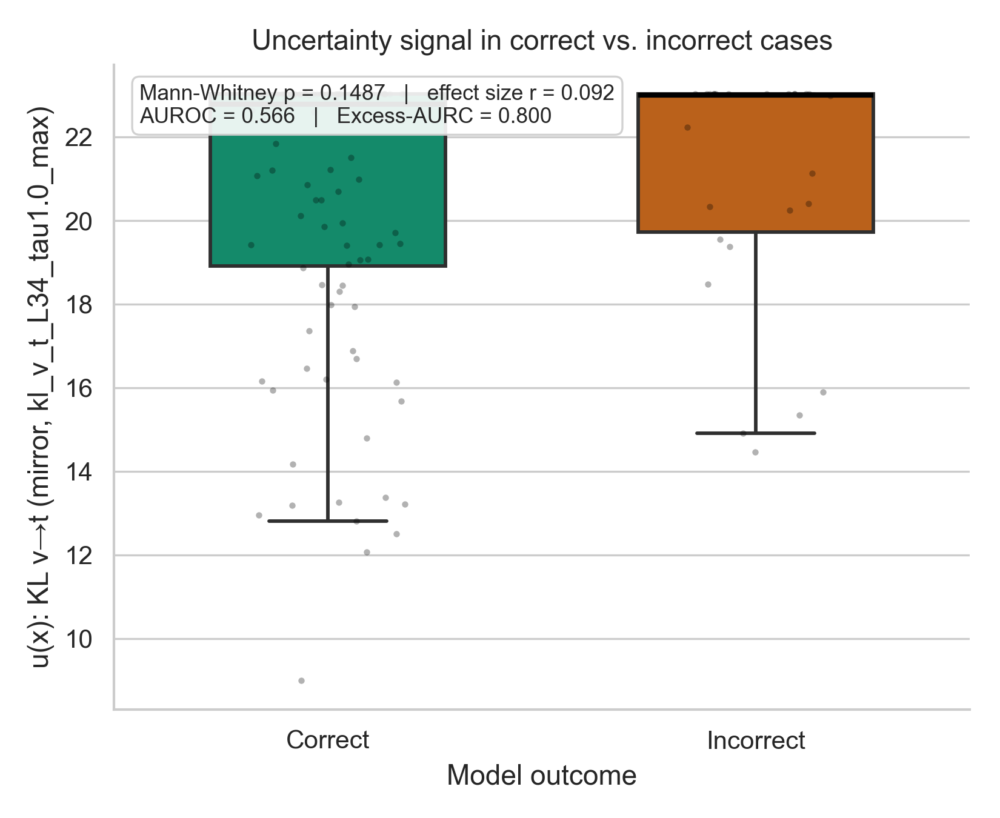

**Interpretación:** KL(t‖v) pondera por donde el **texto** pone su masa — mide *"¿el texto afirma lo que la imagen no respalda?"*, la dirección de la **alucinación** → señal del error. KL(v‖t) pondera por donde la **imagen** pone su masa — mide la riqueza trivial imagen>texto (una retinografía siempre contiene más que un sí/no), casi constante entre imágenes → ruido. Detalle fino: el desplazamiento de medianas es parecido en ambas (+0.25 vs. +0.23), pero el AUROC no, porque depende del solapamiento completo de las distribuciones: en v→t las colas se solapan mucho más (dispersión 9–23 nats, cajas superpuestas en la figura) y su p-value ni siquiera es significativo. La **ablación exhaustiva de fusión** (8 poolings × 3 τ × 6 fusiones, [§7.1](07_Ablaciones_y_Analisis_Profundo.md)) cerró la puerta final: mezclar ambas direcciones solo **diluye** la señal. La dirección espejo se reporta siempre junto a la ganadora (T1, Fig 2–4, evaluation_summary) como evidencia de que la elección fue empírica, no arbitraria.

---

## 6.10 Baselines multi-pass

### 6.10.1 Verbalized Confidence (P5, costo 2×)

Tras responder P1, se le pregunta al modelo su confianza (0–100). Resultados sobre las 129 imágenes:

- **AUROC = 0.519 (≈ azar).** La señal es casi inútil para detectar errores.
- **Degeneración total de la escala:** el modelo solo declara **2 valores**: 95 (n = 118) y 90 (n = 11). Ningún otro número aparece en las 129 respuestas.
- **Sobreconfianza extrema:** declara 95% → accuracy real 80.5%; declara 90% → accuracy real 72.7%.
- Tampoco aporta a las combinaciones: verb+KL+MSP = 0.694 ≤ 0.698 de la combinación sin verb.

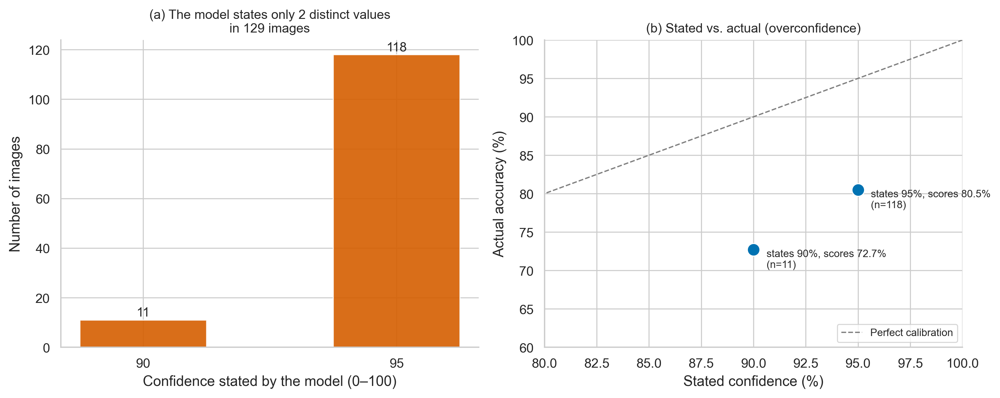

**Interpretación:** los VLMs instruction-tuned están tan alineados a responder con aplomo que no usan la escala completa de confianza. "Simplemente preguntarle al modelo" no funciona: su confianza declarada es degenerada. Nuestra señal 1× (0.661/0.698) supera claramente a este baseline 2×.

### 6.10.2 Self-Consistency (SC, costo 10×, T = 1.5)

50 imágenes (subconjunto estratificado) × 10 muestras × 2 prompts, a temperatura **1.5** (elegida alta de diseño: con la $p_{yes}$ mediana ≈ 0.9999, temperaturas menores producen votos unánimes y la señal muere):

- **Hallazgo clave:** a T=1.5 la mayoría de las muestras genera tokens **fuera de formato** ("based", "i", "the", "it", "while") en vez de "yes"/"no". La entropía binaria sí/no es casi nula (el modelo casi nunca dice "no" al muestrear).
- Mejor señal SC: **`frac_other`** (fracción de respuestas fuera de formato) → AUROC = **0.655**, pero Mann-Whitney p = 0.054 (no significativa).
- Entropía binaria: 0.573. Entropía 3-vías (yes/no/other): 0.552, p = 0.294.

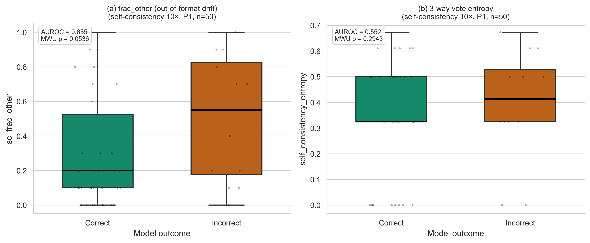

**Interpretación:** MedGemma no es robusto al muestreo estocástico — la inestabilidad generativa ("deriva" fuera del formato instruido) puede ser en sí misma un proxy de incertidumbre (es lo que captura `frac_other`), pero es una señal más débil que la KL y 10× más cara. Nota metodológica: los AUROCs del subconjunto SC (50 imágenes, 12 errores) **no son comparables** con los de la cohorte de 129 — por eso la comparación justa va en su propia tabla ([§6.10.3](#6103-comparación-costo-beneficio-tabla-t4--figura-7)).

### 6.10.3 Comparación costo-beneficio (Tabla T4 + Figura 7)

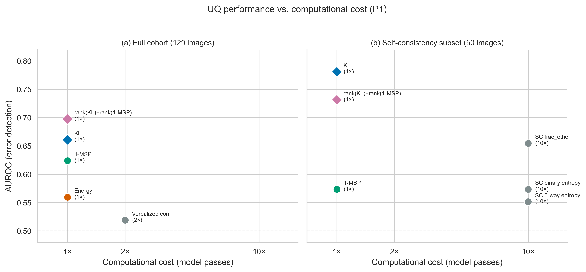

**Tabla T4 (costo vs. AUROC; los dos conjuntos de evaluación etiquetados por separado — nunca mezclados):**

| Método | Costo | AUROC | Conjunto de evaluación |
|---|---|---|---|
| rank(KL)+rank(1−MSP) | 1× | 0.698 | 129 |
| KL cross-modal (nuestra) | 1× | 0.661 | 129 |
| 1−MSP | 1× | 0.624 | 129 |
| Energy | 1× | 0.560 | 129 |
| Verbalized Confidence | 2× | 0.519 | 129 |
| **KL cross-modal (nuestra)** | **1×** | **0.781** | 50 (subconjunto SC) |
| rank(KL)+rank(1−MSP) | 1× | 0.731 | 50 (SC) |
| SC frac_other | 10× | 0.655 | 50 (SC) |
| 1−MSP | 1× | 0.573 | 50 (SC) |
| SC entropía binaria | 10× | 0.573 | 50 (SC) |
| SC entropía 3-vías | 10× | 0.552 | 50 (SC) |

*Nota metodológica:* en el subconjunto SC, `correct` se toma de la **corrida greedy principal** para TODAS las señales (es el modelo que estaría desplegado). Con `correct` del voto SC, la KL daría 0.772 en vez de 0.781; se documenta el criterio (greedy) y no se mezclan conjuntos de evaluación en una misma tabla sin etiquetar.

**Resultado central — dominancia Pareto:** la KL cross-modal (1×) **domina a TODOS los baselines multi-pass (10×)** en AUROC con 10× menos cómputo. En comparación justa sobre las mismas 50 imágenes: KL (1×) = **0.781** vs. SC frac_other (10×) = 0.655. El panel izquierdo de la Figura 7 (cohorte 129) y el derecho (subconjunto 50) cuentan la misma historia.

---

## 6.11 Tabla T2 de ablaciones (97 variantes)

Top-20 por AUROC en la cohorte completa (referencia; la selección se hizo solo en train, [§6.2](#62-selección-de-la-variante-ganadora-solo-en-train)):

| # | Tipo | τ | Pooling | AUROC (129) | AUROC (train) |
|---|---|---|---|---|---|
| 1 | kl_t_v | 1.0 | **max** ★ | **0.661** | 0.728 |
| 2 | kl_t_v | 2.0 | max | 0.578 | 0.591 |
| 3 | jsd | 1.0 | rollout | 0.572 | 0.526 |
| 4 | cosine | * | roi (n=69) | 0.569 | 0.458 |
| 5 | kl_v_t | 1.0 | max | 0.566 | 0.619 |
| 6 | jsd | 1.0 | mean | 0.566 | 0.523 |
| 7 | kl_v_t | 1.0 | topk | 0.557 | 0.539 |
| 8 | jsd | 1.0 | normw | 0.548 | 0.503 |
| 9 | jsd | 1.0 | max | 0.542 | 0.577 |
| 10 | jsd | 2.0 | rollout | 0.541 | 0.520 |
| 11 | jsd | 4.0 | max | 0.540 | 0.550 |
| 12 | kl_v_t | 2.0 | roi (n=69) | 0.539 | 0.566 |
| 13 | kl_v_t | 2.0 | topk | 0.539 | 0.518 |
| 14 | kl_t_v | 1.0 | rollout | 0.533 | 0.527 |
| 15 | jsd | 2.0 | max | 0.530 | 0.557 |
| 16 | jsd | 2.0 | normw | 0.528 | 0.505 |
| 17 | jsd | 2.0 | mean | 0.528 | 0.504 |
| 18 | jsd | 1.0 | attn | 0.527 | 0.502 |
| 19 | kl_v_t | 2.0 | attn | 0.527 | 0.521 |
| 20 | kl_t_v | 4.0 | rollout | 0.526 | 0.509 |

**Tendencias** (análisis completo en [07](07_Ablaciones_y_Analisis_Profundo.md)): `max` > `mean`; τ = 1 > τ > 1; `kl_t_v` > `kl_v_t`; JSD saturada; coseno sin aporte; roi (oracle) **no** generaliza (0.349 en la corrida completa); kl_prompt por debajo del azar (0.483) — la señal útil está en la respuesta, no en el prompt.

---

## 6.12 Tabla T3 comparativa con la literatura

| Método | Single-pass | Training-free | Cross-modal | Costo |
|---|---|---|---|---|
| MC-Dropout | No | No | No | 10–100× |
| Semantic Entropy | No | Sí | No | 10× |
| UMPIRE | No | Sí | No | Multi-sample |
| VIG-TUQ | Attention only | Sí | Sí | 1× (attention), 2× (JSD) |
| SAPLMA (probes) | Sí | No | No | Supervisado |
| **Nuestro (KL cross-modal)** | **Sí** | **Sí** | **Sí** | **1×** |

La comparación es sobre **propiedades del método**, no sobre AUROC directo: cada trabajo usa datasets y modelos distintos, así que los números no son conmensurables. Lo que la tabla muestra es que **ningún método publicado reúne simultáneamente** las tres propiedades que definen a la nuestra (single-pass + training-free + cross-modal) — ese es el nicho exacto de la contribución. El posicionamiento cualitativo frente a NoLan/VCD/ConVis/FUSE/Dropout Decoding/FairCLIP está en [§8.1b](08_Discusion_y_Limitaciones.md).

---

## 6.13 Calibración de la señal (análisis estilo FUSE §5.2; añadido 03-ago-2026)

Además de discriminar (AUROC), una señal de triage idealmente debería estar **calibrada**: que a mayor $u(x)$ mayor probabilidad empírica de error. Se evaluó siguiendo el protocolo de FUSE §5.2 / Guo et al. (2017):

- **Platt scaling** (sigmoide de 1 feature: $u \rightarrow P(error)$) ajustado **SOLO con el split train** (77 imágenes) y aplicado congelado al split de análisis.
- **Bins equiprobables** (10 bins ≈ 13 observaciones/bin) para el reliability diagram y el **ECE** (Expected Calibration Error: media ponderada de $|\bar{u}_{bin} - error_{empírico,bin}|$), con sensibilidad a 5 bins.
- **Correlaciones de calibración** Pearson/Spearman entre $u$ calibrada y tasa empírica de error por bin, y **Brier score**.
- **IC bootstrap percentil 95%** (Platt fijo, remuestreo de observaciones); flag `in_sample` cuando el split de análisis es el propio train.
- **TPR de detección de errores a FPR fijos** (5%, 10%, 20%) — puntos operativos de alarma; TPR@FPR20% coincide con el Sens@80%Spec de la Tabla T1 (0.423), control de coherencia.

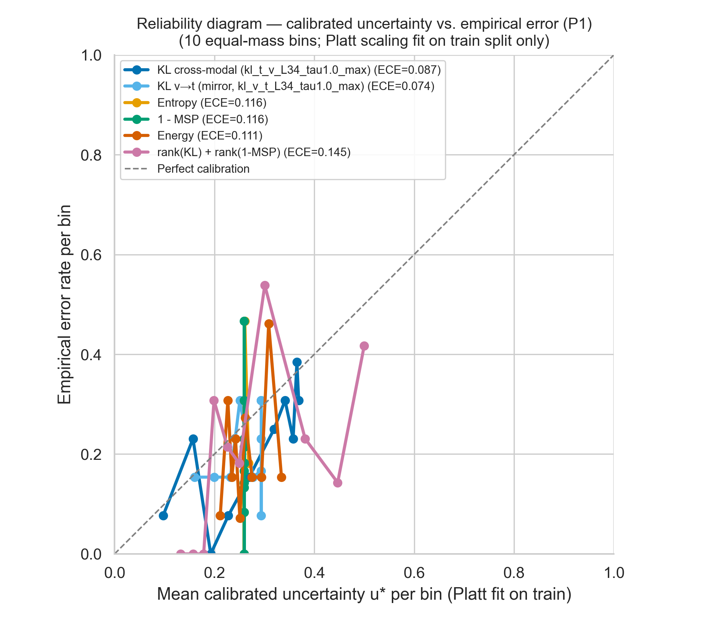

**Tabla T5 (discriminación + calibración lado a lado, espejo de FUSE Table 1; P1, N = 129):**

| Señal | AUROC | TPR@FPR5% | TPR@FPR10% | TPR@FPR20% | ECE ↓ | Cal. Pearson | Cal. Spearman | Brier | Costo |
|---|---|---|---|---|---|---|---|---|---|
| **KL cross-modal (kl_t_v_L34_tau1.0_max)** | **0.661** | 0.077 | **0.269** | **0.423** | **0.087** | **0.748** | **0.789** | **0.159** | 1× |
| KL v→t (espejo) | 0.566 | 0.115 | 0.192 | 0.308 | 0.074 | 0.283 | 0.532 | 0.164 | 1× |
| Entropy | 0.624 | 0.038 | 0.102 | 0.385 | 0.116 | 0.094 | 0.612 | 0.164 | 1× |
| 1 − MSP | 0.624 | 0.038 | 0.102 | 0.385 | 0.116 | 0.020 | 0.612 | 0.164 | 1× |
| Energy | 0.560 | 0.038 | 0.077 | 0.308 | 0.111 | 0.269 | 0.181 | 0.164 | 1× |
| rank(KL) + rank(1−MSP) | **0.698** | **0.154** | 0.192 | 0.308 | 0.145 | 0.549 | 0.656 | **0.159** | 1× |

**Lectura:**

- La KL cross-modal es la **mejor calibrada entre las señales 1× discriminativas**: ECE 0.087 (IC 95% [0.085, 0.185]) y correlaciones de calibración 0.748/0.789 — las más altas con diferencia. El espejo tiene ECE algo menor (0.074) pero no discrimina (AUROC 0.566) ni ordena la probabilidad de error (Pearson 0.283).
- La **combinación discrimina más pero calibra peor** (ECE 0.145): al sumar ranks se gana orden global pero se pierde granularidad probabilística. Trade-off real a declarar en el paper: para triage por ranking se usa la combinación; para probabilidad de error interpretable, la KL sola.
- Entropy/1−MSP tienen correlaciones de calibración **casi nulas** (Pearson 0.02–0.09): con la $p_{yes}$ saturada en ≈ 0.9999, la confianza de salida no dice nada sobre la probabilidad de error — la versión cuantitativa del argumento de sobreconfianza de [§8.1](08_Discusion_y_Limitaciones.md).
- El Brier es casi idéntico en todas (≈ 0.16): lo domina la tasa base de error (0.202), no la señal.
- En puntos operativos estrictos la señal es modesta: a FPR 5% solo captura el 7.7% de los errores; el punto clínicamente útil empieza en FPR 10–20%.

**Advertencias honestas (evidencia SECUNDARIA):** (a) con N = 129 hay ~13 observaciones por bin: el ECE es ruidoso (IC ancho) y la Platt quedó ajustada con las mismas 77 imágenes de train que luego forman parte de la cohorte evaluada (parcialmente in-sample); (b) Platt es **monótona por construcción**, así que correlaciones altas no prueban calibración por sí solas — la evidencia principal es el ECE + el reliability diagram (Figura 10); (c) la calibración **no** entra en las hipótesis H1–H4: es un análisis complementario post-hoc. El código de calibración se validó contra datos sintéticos en `validacion/val_09_calibracion.py` (6/6 checks, [§12.3b](12_Verificacion_y_Validacion.md)).

---

[⬅️ 05 — Implementación Software](05_Implementacion_Software.md) | [➡️ 07 — Ablaciones y Análisis Profundo](07_Ablaciones_y_Analisis_Profundo.md)
