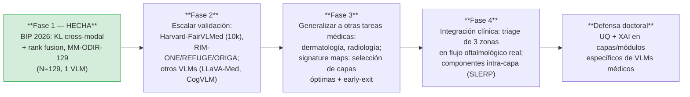

# 11 — Conclusiones y Próximos Pasos

> **Propósito:** cerrar la documentación con las conclusiones formales de esta fase doctoral, la verificación explícita de las hipótesis y el roadmap que conecta este experimento con la tesis completa.

[⬅️ 10 — Guía de Reproducibilidad](10_Guia_Reproducibilidad.md) | [➡️ 12 — Verificación y Validación](12_Verificacion_y_Validacion.md)

---

## 11.1 Contribuciones de esta fase

1. **Contribución original #1 — Señal KL cross-modal intra-modelo:** primera demostración empírica del *cross-modal representation disagreement* (divergencia KL entre los hidden states visuales y el estado textual del decoder, en un solo forward pass) como señal de UQ en VLMs médicos. Sin precedente en la literatura (verificación por especialista externo, [§2.4](02_Marco_Teorico.md)). Resultado: AUROC 0.661 [0.522, 0.772], p = 0.006, con dominancia Pareto sobre todos los baselines multi-pass (2× y 10×).
2. **Contribución original #2 — Fusión parameter-free `rank(KL) + rank(1−MSP)`:** primera combinación por agregación de rangos de una señal del espacio de representaciones internas (cross-modal) con una señal del espacio de salida (MSP) para UQ en VLMs — verificado como sin precedente. Resultado: AUROC 0.698 [0.596, 0.787], Excess-AURC 0.407 (39% más cerca del oracle que la KL sola), zona verde del 30.2% sin errores.
3. **Framework de evaluación con 97 variantes y baselines de igual costo**, todas extraídas en la misma pasada: un banco de pruebas reutilizable para UQ en VLMs (ablaciones completas en [07](07_Ablaciones_y_Analisis_Profundo.md)), ampliado con la **suite de calibración estilo FUSE §5.2** (Platt en train, ECE, correlaciones, Brier, TPR@FPR — [§6.13](06_Resultados_Experimentales.md)) y su validación sintética (`val_09`, [§12.3b](12_Verificacion_y_Validacion.md)).
4. **Pipeline training-free, single-pass, costo 1×**, reproducible y documentado a nivel de re-implementación ([05](05_Implementacion_Software.md), [10](10_Guia_Reproducibilidad.md)).
5. **Verificación independiente del pipeline completo** como práctica doctoral distintiva: val_08 (19/19 checks con código independiente), re-computación manual cross-GPU (logits bitwise idénticos), verificación de la zona verde desde el CSV crudo ([12](12_Verificacion_y_Validacion.md)).

## 11.2 Verificación de hipótesis

| Hipótesis | Resultado | Evidencia |
|---|---|---|
| **H1:** KL cross-modal > azar para detectar errores | **Verificada** | AUROC 0.661 [0.522, 0.772], p = 0.006, r = 0.223; IC excluye 0.5 |
| **H2:** KL > baselines de igual costo | **Parcial** | +0.037 AUROC sobre 1−MSP/entropy, +0.101 sobre energy; la ventaja clara está en la combinación |
| **H3:** combinación > componentes | **Verificada (exploratoria)** | 0.698 [0.596, 0.787], p = 0.00096; Excess-AURC 0.407 vs. 0.670/0.732; ICs solapados con N=129 → carácter exploratorio |
| **H4:** correlación con severidad (CDR) | **Rechazada** | Spearman rho = +0.001, p = 0.99 (permutación, n = 69). La señal detecta errores del modelo, NO severidad del glaucoma |

**Conclusión científica central:** el desacuerdo cross-modal interno de un VLM médico, medido en una sola pasada y sin entrenar nada, es una señal real (aunque moderada) de alarma de error — y fusionada sin parámetros con la confianza de salida habilita un esquema de triage en 3 zonas donde el 30.2% menos incierto de la cohorte no contiene errores. La generalización honesta (Monte Carlo CV) ubica el desempeño en pacientes nuevos en ~0.58–0.66 para la KL sola y 0.648–0.698 para la combinación: suficiente para proof-of-concept y para justificar la Fase 2, no para deployment clínico.

## 11.3 Roadmap doctoral

- **Fase 2 — escalar:** validación en datasets grandes (Harvard-FairVLMed, 10.000 imgs SLO + notas clínicas, es el candidato natural por prevalencia y por su línea de equidad) y en otros VLMs. Pregunta: ¿la señal es propiedad del mecanismo o del modelo?
- **Fase 3 — generalizar:** otras tareas médicas de screening; profundizar en la selección de capas (barrido fino 27–34) y early-exit como extensión de eficiencia.
- **Fase 4 — integración clínica:** protocolo de triage de 3 zonas (auto-responder cola, derivar cabeza, zona gris al especialista) validado prospectivamente; XAI (Grad-CAM/IG) como capa de explicación al oftalmólogo sobre los casos derivados.
- **Pendiente inmediato antes de submission BIP 2026:** análisis de robustez excluyendo imágenes con artefactos de anotación ([§8.4](08_Discusion_y_Limitaciones.md)) y redacción del paper con citación anonimizada del dataset (doble ciego, [§9.6](09_Dataset_MM_ODIR_129.md)).

---

[⬅️ 10 — Guía de Reproducibilidad](10_Guia_Reproducibilidad.md) | [➡️ 12 — Verificación y Validación](12_Verificacion_y_Validacion.md)
