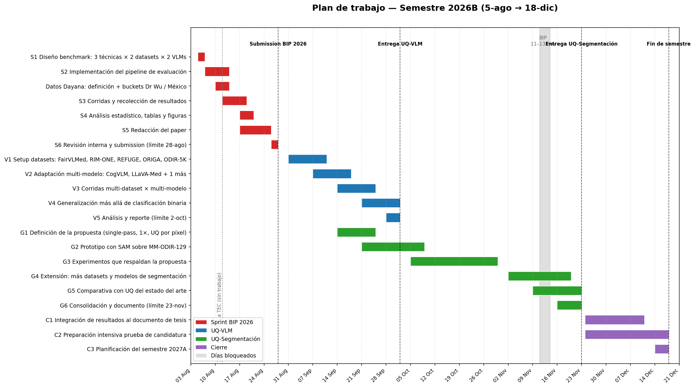

# Plan de Trabajo — Semestre 2026B

**Doctorando:** Miguel Guillermo Abreu Cárdenas
**Período:** 5 de agosto → 18 de diciembre de 2026 (\~19.5 semanas)
**Carga semanal:** 40 horas (lunes a viernes, 8:30–17:30, con 1 hora de almuerzo = 8 h efectivas/día)
**Última actualización:** 5 de agosto de 2026

***

## 1. Resumen ejecutivo

El semestre se organiza en **tres líneas de investigación con entregables concretos** más un **bloque fijo diario de formación doctoral** (tesis, literatura y base de conocimiento para la prueba de candidatura):

| Línea               | Entregable                                                                                                                        | Fecha límite        |
| ------------------- | --------------------------------------------------------------------------------------------------------------------------------- | ------------------- |
| **Sprint BIP 2026** | Paper de benchmark de UQ en VLMs (3 técnicas × 2 datasets × 2 modelos)                                                            | **28 de agosto**    |
| **UQ-VLM**          | Generalización de la técnica: ≥3 datasets y ≥3 VLMs adicionales + extensión más allá de clasificación binaria                     | **2 de octubre**    |
| **UQ-Segmentación** | Propuesta nueva de UQ por píxel (single-pass, costo 1×, sin reentrenamiento) con SAM, validada y comparada con el estado del arte | **23 de noviembre** |

El cierre del semestre (24-nov → 18-dic) se dedica a integrar resultados en el documento de tesis, intensificar la preparación de la **prueba de candidatura** y planificar el semestre 2027A.

**Decisiones ya tomadas:**
1. La conferencia en el TEC es el **miércoles 12 de agosto** (todo el día, sin actividades) — ya bloqueada en el Gantt y en el calendario diario.
2. Durante el sprint BIP 2026 (5–28 ago) los **bloques fijos se limitan** a tesis 1 h/día, literatura 1 h/día y base de conocimiento 0.5 h/día, para dedicar la mayor cantidad de horas posible al sprint (ver §4.0 y §5.3).

📅 **Calendario día por día de todo el semestre:** [Plan_Calendario_Diario_2026B.md](Plan_Calendario_Diario_2026B.md) (98 días laborables, con horas por tarea cada día; también en CSV: `plan_semestre/calendario_semestre_2026B.csv`).

***

## 2. Presupuesto de horas semanales (40 h)

### 2.1 Bloques fijos diarios (25 h/semana)

| Actividad                                                                                                         | L–V     | Horas/semana |
| ----------------------------------------------------------------------------------------------------------------- | ------- | ------------ |
| Redacción de la tesis                                                                                             | 2 h/día | 10 h         |
| Estudio de la literatura                                                                                          | 2 h/día | 10 h         |
| Base de conocimiento en Obsidian (manual, sin IA; preparación prueba de candidatura, integrada con la literatura) | 1 h/día | 5 h          |
| **Subtotal fijo**                                                                                                 |    | **25 h**     |

### 2.2 Compromisos recurrentes y reuniones (\~6.9 h/semana promedio)

| Actividad                                                                | Frecuencia                                     | Horas               |
| ------------------------------------------------------------------------ | ---------------------------------------------- | ------------------- |
| Reunión con practicantes                                                 | Martes 2:30 pm (máx. 1 h)                      | 1 h/sem             |
| Organización BIP 2026 (comité)                                           | Sin día fijo → asignado miércoles 2:30–4:30 pm | 2 h/sem             |
| Herramienta de etiquetado vieja (buckets, estructura nueva datos Dr. Wu) | Hasta octubre → lunes y jueves 2:30–4:30 pm    | 4 h/sem (hasta oct) |
| Reunión pasantía (Ángel y Micaela)                                       | Viernes alternos 8:30 am (1–1.5 h)             | \~0.75 h/sem prom.  |
| Reunión de investigación con el tutor                                    | Viernes alternos 2:00–4:00/4:30 pm             | \~1.1 h/sem prom.   |

### 2.3 Horas de investigación disponibles por fase

| Período                 | Investigación directa disponible                                                                                          | Destino                     |
| ----------------------- | ------------------------------------------------------------------------------------------------------------------------ | --------------------------- |
| 5-ago → 28-ago (sprint) | **~19 h/sem** (bloques fijos limitados a 2.5 h/día: tesis 1 h, literatura 1 h, Obsidian 0.5 h — ver §4.0)                | Sprint BIP 2026             |
| 31-ago → 11-sep         | \~6 h/sem                                                                                                                | UQ-VLM                      |
| 14-sep → 2-oct          | \~6 h/sem (3 h UQ-VLM + 3 h UQ-Seg)                                                                                      | Ambas en paralelo           |
| 5-oct → 23-nov          | \~10 h/sem (la herramienta de etiquetado termina y libera 4 h)                                                           | UQ-Segmentación             |
| 24-nov → 18-dic         | \~10 h/sem                                                                                                               | Cierre: tesis + candidatura |

**Total estimado de horas de investigación directa en el semestre: \~185 h** (\~65 h solo para el sprint), más 25 h/sem fijas de formación doctoral (12.5 h/sem durante el sprint).

***

## 3. Desglose de tareas y subtareas (WBS)

### 3.1 Sprint BIP 2026 — Paper de benchmark de UQ en VLMs (5-ago → 28-ago)

**Objetivo:** paper de benchmark que compare **3 técnicas de UQ** × **2 datasets** × **2 modelos VLM**.

| ID | Subtarea                                                                                                                                                                                                                      | Fechas      | Entregable                             |
| -- | ----------------------------------------------------------------------------------------------------------------------------------------------------------------------------------------------------------------------------- | ----------- | -------------------------------------- |
| S1 | Diseño del benchmark: seleccionar 3 técnicas (p. ej. KL cross-modal, entropía/MSP, self-consistency), 2 datasets (MM-ODIR-129 + 1 de {RIM-ONE, REFUGE}) y 2 VLMs (MedGemma + LLaVA-Med). Definir métricas (AUROC, AUPRC, ECE) | 5 → 7 ago   | Protocolo de 1 página                  |
| S2 | Implementación del pipeline de evaluación unificado (reusar `src/` del proyecto actual)                                                                                                                                       | 7 → 14 ago  | Código funcional                       |
| S3 | Corridas y recolección de resultados (GPU)                                                                                                                                                                                    | 12 → 19 ago | `results_*.csv`                        |
| S4 | Análisis estadístico, tablas y figuras                                                                                                                                                                                        | 17 → 21 ago | Tablas T1–T3 + figuras                 |
| S5 | Redacción del paper (en paralelo a S3–S4)                                                                                                                                                                                     | 17 → 26 ago | Borrador completo                      |
| S6 | Revisión interna con el tutor y submission                                                                                                                                                                                    | 26 → 28 ago | **Paper enviado (28-ago)**             |
| D1 | **Datos Dayana (semana del 10-ago, 4 h):** definir qué datos debe reunir; crear bucket nuevo separando `Dr Wu/` y `Mexico/`, una carpeta por origen                                                                           | 10 → 14 ago | Estructura de buckets + especificación |

### 3.2 UQ-VLM — Generalización de la técnica (31-ago → 2-oct)

**Objetivo:** demostrar que la señal de UQ cross-modal (KL) generaliza a **≥3 datasets y ≥3 VLMs adicionales**, y que no se limita a clasificación binaria.

| ID | Subtarea                                                                                                                                                               | Fechas          | Entregable                   |
| -- | ---------------------------------------------------------------------------------------------------------------------------------------------------------------------- | --------------- | ---------------------------- |
| V1 | Setup de datasets: descarga y loaders de **Harvard-FairVLMed, RIM-ONE, REFUGE, ORIGA, ODIR-5K** (mínimo 3; priorizar RIM-ONE y REFUGE por tener etiquetas de glaucoma) | 31 ago → 11 sep | Loaders + tablas maestras    |
| V2 | Adaptación multi-modelo: **CogVLM, LLaVA-Med** + un tercero a definir (candidatos: Qwen2-VL, BioMedGPT); abstracción de extracción de hidden states por arquitectura   | 7 → 18 sep      | Pipeline multi-VLM           |
| V3 | Corridas multi-dataset × multi-modelo (matriz de generalización)                                                                                                       | 14 → 25 sep     | CSVs de resultados           |
| V4 | Generalización más allá de clasificación binaria: formulación multi-clase y/u ordinal (p. ej. grados de severidad) de la señal KL                                      | 21 sep → 2 oct  | Resultados multi-clase       |
| V5 | Análisis estadístico y reporte consolidado                                                                                                                             | 28 sep → 2 oct  | **Reporte + tablas (2-oct)** |

### 3.3 UQ-Segmentación — UQ por píxel con SAM (14-sep → 23-nov)

**Objetivo:** definir y validar una técnica **nueva** de cuantificación de incertidumbre **por píxel** para segmentación, con las mismas restricciones del proyecto: **single-pass, costo 1×, sin reentrenamiento**. Punto de partida: **SAM** sobre **MM-ODIR-129** (máscaras copa/disco disponibles como ground truth).

| ID | Subtarea                                                                                                                                                                                                                                                                              | Fechas                                 | Entregable                                                                  |
| -- | ------------------------------------------------------------------------------------------------------------------------------------------------------------------------------------------------------------------------------------------------------------------------------------- | -------------------------------------- | --------------------------------------------------------------------------- |
| G1 | **Definición de la propuesta:** revisión de literatura de UQ en segmentación; candidatos de señal single-pass (consistencia interna de máscaras de SAM ante prompts/perturbaciones, dispersión de logits de máscara, scores de estabilidad de SAM); documento de diseño con hipótesis | 14 → 25 sep                            | Documento de diseño (análogo a `Definicion_Experimental_Minima_BIP2026.md`) |
| G2 | **Prototipo** con SAM sobre MM-ODIR-129: segmentación de copa/disco, extracción de la señal UQ por píxel, sanity checks                                                                                                                                                               | 21 sep → 9 oct                         | Prototipo + piloto                                                          |
| G3 | **Experimentos que respaldan la propuesta:** correlación UQ↔error de segmentación (Dice/IoU por píxel), calibración, casos de falla                                                                                                                                                   | 5 → 30 oct                             | Resultados experimentales                                                   |
| G4 | **Extensión:** más datasets (fundus con máscaras: REFUGE, ORIGA) y más modelos de segmentación (SAM 2, MedSAM u otros)                                                                                                                                                                | 2 → 20 nov *(pausa 11–13 nov por BIP)* | Matriz de generalización                                                    |
| G5 | **Comparativa con UQ del estado del arte** (ensembles, MC-dropout, test-time augmentation) para validar fuertemente la técnica                                                                                                                                                        | 9 → 23 nov                             | Tabla comparativa                                                           |
| G6 | Consolidación y documento de resultados                                                                                                                                                                                                                                               | 16 → 23 nov                            | **Reporte final (23-nov)**                                                  |

### 3.4 Cierre de semestre (24-nov → 18-dic)

| ID | Subtarea                                                                                                                  | Fechas          |
| -- | ------------------------------------------------------------------------------------------------------------------------- | --------------- |
| C1 | Integración de todos los resultados (BIP benchmark, UQ-VLM, UQ-Seg) al documento de tesis                                 | 24 nov → 11 dic |
| C2 | Preparación intensiva de la prueba de candidatura (sobre la base de conocimiento en Obsidian construida todo el semestre) | 24 nov → 18 dic |
| C3 | Planificación del semestre 2027A                                                                                          | 14 → 18 dic     |

***

## 4. Horario semanal tipo (sin tiempo vacío)

Jornada **8:30–17:30**, almuerzo **12:30–13:30** → 8 h efectivas/día, 40 h/semana.

### 4.0 Semana de sprint (5 → 28 ago) — bloques fijos limitados

Durante el sprint BIP 2026 los bloques fijos se reducen a la mitad y toda la tarde se dedica al sprint (menos reuniones y compromisos ya agendados). El **miércoles 12-ago** es la conferencia en el TEC (día completo bloqueado).

| Hora        | Actividad                                                                                  |
| ----------- | ------------------------------------------------------------------------------------------ |
| 08:30–09:30 | Redacción de tesis (1 h)                                                                   |
| 09:30–10:30 | Estudio de literatura (1 h)                                                                |
| 10:30–11:00 | Base de conocimiento Obsidian, manual (0.5 h)                                              |
| 11:00–12:30 | **Sprint BIP 2026** (subtarea S1–S6 vigente)                                               |
| 12:30–13:30 | **Almuerzo**                                                                               |
| 13:30–17:30 | **Sprint BIP 2026** (menos: mar 14:30–15:30 practicantes · mié 14:30–16:30 org. BIP · lun/jue 14:30–16:30 etiquetado · vie alternos reuniones) |

Esto da **~19 h/semana de sprint** (la semana del 10-ago queda en ~15 h por la conferencia del 12 y las 4 h de datos Dayana/buckets).

### 4.1 Lunes

| Hora        | Actividad                                                   |
| ----------- | ----------------------------------------------------------- |
| 08:30–10:30 | Redacción de tesis                                          |
| 10:30–12:30 | Estudio de literatura                                       |
| 12:30–13:30 | **Almuerzo**                                                |
| 13:30–14:30 | Base de conocimiento (Obsidian, manual)                     |
| 14:30–16:30 | Herramienta de etiquetado (hasta oct) → luego investigación |
| 16:30–17:30 | Investigación (proyecto de la fase vigente)                 |

### 4.2 Martes

| Hora        | Actividad                               |
| ----------- | --------------------------------------- |
| 08:30–10:30 | Redacción de tesis                      |
| 10:30–12:30 | Estudio de literatura                   |
| 12:30–13:30 | **Almuerzo**                            |
| 13:30–14:30 | Base de conocimiento (Obsidian)         |
| 14:30–15:30 | **Reunión con practicantes** (máx. 1 h) |
| 15:30–17:30 | Investigación                           |

### 4.3 Miércoles

| Hora        | Actividad                                     |
| ----------- | --------------------------------------------- |
| 08:30–10:30 | Redacción de tesis                            |
| 10:30–12:30 | Estudio de literatura                         |
| 12:30–13:30 | **Almuerzo**                                  |
| 13:30–14:30 | Base de conocimiento (Obsidian)               |
| 14:30–16:30 | **Organización BIP 2026** (comité, 2 h fijas) |
| 16:30–17:30 | Investigación                                 |

### 4.4 Jueves

Idéntico al lunes (2 h de herramienta de etiquetado hasta octubre; luego investigación).

### 4.5 Viernes tipo A — con reunión de pasantía (Ángel y Micaela)

Fechas: **14-ago, 28-ago, 11-sep, 25-sep, 9-oct, 23-oct, 6-nov, 20-nov, 4-dic, 18-dic**

| Hora        | Actividad                       |
| ----------- | ------------------------------- |
| 08:30–10:00 | **Reunión pasantía** (1–1.5 h)  |
| 10:00–12:00 | Redacción de tesis              |
| 12:00–12:30 | Estudio de literatura (parte 1) |
| 12:30–13:30 | **Almuerzo**                    |
| 13:30–15:00 | Estudio de literatura (parte 2) |
| 15:00–16:00 | Base de conocimiento (Obsidian) |
| 16:00–17:30 | Investigación                   |

### 4.6 Viernes tipo B — con reunión de tutor

Fechas: **21-ago, 4-sep, 18-sep, 2-oct, 16-oct, 30-oct, ~~13-nov~~ (suspendida por BIP), 27-nov, 11-dic**

| Hora              | Actividad                                                           |
| ----------------- | ------------------------------------------------------------------- |
| 08:30–10:30       | Redacción de tesis                                                  |
| 10:30–12:30       | Estudio de literatura                                               |
| 12:30–13:30       | **Almuerzo**                                                        |
| 13:30–14:00       | Base de conocimiento (Obsidian) — incluye preparación de la reunión |
| 14:00–16:00/16:30 | **Reunión de investigación con el tutor**                           |
| 16:00/16:30–17:30 | Base de conocimiento (cierre, 0.5 h) + investigación                |

### 4.7 Asignación de los bloques de "Investigación" por fase

| Período         | Destino de los bloques de investigación                                                                              |
| --------------- | -------------------------------------------------------------------------------------------------------------------- |
| 5-ago → 28-ago  | Sprint BIP 2026 (todos los bloques)                                                                                  |
| 31-ago → 11-sep | UQ-VLM (V1–V2)                                                                                                       |
| 14-sep → 2-oct  | Lunes/martes/jueves: UQ-VLM (V3–V5) · Miércoles/viernes: UQ-Seg (G1–G2)                                              |
| 5-oct → 23-nov  | UQ-Segmentación (G3–G6); desde el 5-oct las 4 h de la herramienta de etiquetado (lun/jue 14:30–16:30) pasan a UQ-Seg |
| 24-nov → 18-dic | Cierre (C1–C3)                                                                                                       |

***

## 5. Excepciones, conflictos y decisiones

### 5.1 Días bloqueados

* **Miércoles 12 de agosto** — conferencia en el TEC todo el día: sin actividades (confirmado). Cae en pleno sprint; el calendario diario ya lo descuenta.

* **Miércoles 11 → viernes 13 de noviembre** — BIP 2026 (comité organizador): sin bloques regulares. La reunión de tutor del 13-nov se suspende (se repone el 20-nov si el tutor lo considera).

* El Gantt ya descuenta estos días: la subtarea G4 (2 → 20 nov) tiene holgura suficiente para absorber la pausa del 11–13 nov.

### 5.2 Reglas de la base de conocimiento (prueba de candidatura)

* Redacción **manual, sin ayuda de IA**, en **Obsidian**, 1 h/día integrada al estudio de literatura (0.5 h/día durante el sprint). Acumulado estimado en el semestre ≈ 85 h de base de conocimiento.

### 5.3 Política del sprint BIP 2026 (5 → 28 ago) — bloques fijos limitados

El sprint tiene prioridad absoluta hasta la submission del 28-ago. Durante esas ~3.5 semanas los bloques fijos se limitan a: **tesis 1 h/día, literatura 1 h/día, base de conocimiento 0.5 h/día** (siempre manual y en Obsidian), dejando **~19 h/semana para el sprint** incluso después de descontar reuniones, organización BIP y la herramienta de etiquetado. A partir del 31-ago todos los bloques vuelven a su duración normal (2/2/1 h).

### 5.4 Riesgos identificados

| Riesgo                                                                            | Mitigación                                                                                                                    |
| --------------------------------------------------------------------------------- | ----------------------------------------------------------------------------------------------------------------------------- |
| Solapamiento UQ-VLM / UQ-Seg (14-sep → 2-oct) con solo \~6 h/sem                  | Definición de G1 apoyada en el bloque de literatura (la revisión de UQ en segmentación alimenta ambos)                        |
| Licencias/acceso a modelos (MedGemma ya resuelto; CogVLM/LLaVA-Med por verificar) | V2 incluye verificación de acceso en la primera semana; tercer modelo se elige entre los que corran en el hardware disponible |
| GPU compartida durante corridas V3 y G3                                           | Corridas cortas por diseño (N pequeño, single-pass); calendarizar en las tardes de investigación                              |
| BIP (11–13 nov) interrumpe G4/G5                                                  | Gantt con holgura; G5 inicia 9-nov y continúa 16-nov                                                                          |

***

## 6. Hitos para seguimiento con el tutor

| Fecha      | Hito                                                                                |
| ---------- | ----------------------------------------------------------------------------------- |
| 14-ago     | Buckets Dr. Wu / México creados + especificación de datos de Dayana                 |
| **28-ago** | **Submission paper benchmark BIP 2026**                                             |
| 11-sep     | Datasets UQ-VLM cargados (≥3)                                                       |
| 18-sep     | Pipeline multi-VLM funcionando (MedGemma + CogVLM + LLaVA-Med)                      |
| 25-sep     | Documento de diseño de la propuesta UQ-Segmentación                                 |
| **2-oct**  | **Entrega UQ-VLM: reporte de generalización**                                       |
| 9-oct      | Prototipo SAM + piloto sobre MM-ODIR-129                                            |
| 30-oct     | Experimentos de respaldo de la propuesta UQ-Seg completos                           |
| 11–13 nov  | BIP 2026 (comité)                                                                   |
| **23-nov** | **Entrega UQ-Segmentación: validación + comparativa SOTA**                          |
| 18-dic     | Cierre de semestre: resultados integrados a tesis, candidatura avanzada, plan 2027A |

